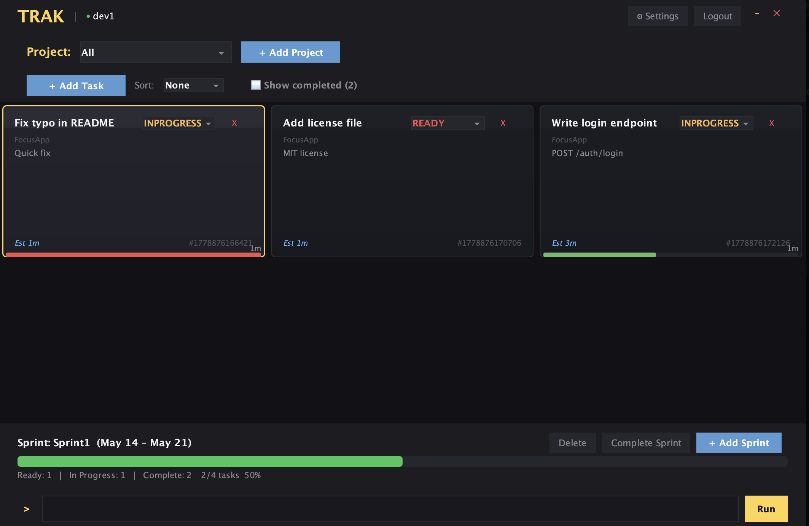

# Trak

**Version 0.0.9**

A sprint planning and task tracking tool. Create projects, break work into tasks, plan sprints, and track progress. When a sprint is active, in-progress tasks show a live countdown against their estimate. Sprints track completed vs total task counts. Available as a CLI, Swing desktop GUI, and REST API server.



## Quick Start

```bash
make build                                           # build all executables
make build-gui && java -jar trak-gui --local --test  # launch GUI with test data
```

Or start the server and connect clients:

```bash
make build-server && java -jar trak-server   # Terminal 1: start REST API
java -jar trak-gui                           # Terminal 2: launch GUI
java -jar trak-cli --remote tasks            # Terminal 3: CLI
```

## Build

Requires Java 17+ and Gradle.

```bash
make build          # build all 3 jars
make build-gui      # build GUI jar only
make build-cli      # build CLI jar only
make build-server   # build server jar only
make test           # run ~200 tests
make clean          # clean artifacts
make reset          # clean + remove .store and .cache
```

## Executables

| Executable | Purpose | Default Mode |
|---|---|---|
| `trak-server` | REST API server | Port 8080 |
| `trak-cli` | Command-line client | Local (direct DB) |
| `trak-gui` | Swing desktop client | Remote (needs server) |

```bash
java -jar trak-server [port]              # start server
java -jar trak-cli [--remote] <command>   # CLI
java -jar trak-gui [--local] [--test]     # GUI
```

## Authentication

A `guest` account (password: `guest`) is created automatically.

```bash
# Interactive login/signup
java -jar trak-cli

# Direct commands
java -jar trak-cli signup manuel --first_name Manuel --last_name Magana --email m@example.com --password pass
java -jar trak-cli login manuel --password pass
java -jar trak-cli logout
```

## CLI Usage

```bash
# Workspace
java -jar trak-cli projects            # list my projects
java -jar trak-cli tasks               # list my tasks
java -jar trak-cli sprints             # list my sprints
java -jar trak-cli detail -p|-t|-s <id> # project/task/sprint details
java -jar trak-cli cur                 # current task + elapsed time
java -jar trak-cli start <task_id>     # start working
java -jar trak-cli end                 # stop working
java -jar trak-cli complete <task_id>  # mark COMPLETE
java -jar trak-cli info                # all commands

# Entity CRUD
java -jar trak-cli project add WebApp --summary "Web app"
java -jar trak-cli task add --title "Fix bug" --project <id> --assigned_to manuel --deadline 2026-06-01 --estimate 2h
java -jar trak-cli sprint add Sprint1 --project WebApp
java -jar trak-cli sprint update Sprint1 --project WebApp --start_date 2026-06-01 --end_date 2026-06-14 --add_task <task_id>
```

## Storage

Data persisted in `.store/`. Five backends (configurable via `.store/workspace.json`):

| Format | Config | Storage |
|---|---|---|
| **DuckDB** (default) | `"duckdb"` | `trak.duckdb` |
| **JSON** | `"json"` | `user_{name}.json`, `task_{id}.json`, etc. |
| **Parquet** | `"parquet"` | `User.parquet`, `Task.parquet`, etc. |
| **Redis** | `"redis"` | Keys: `trak:users:*`, `trak:tasks:*`, etc. |
| **MongoDB** | `"mongo"` | Collections: `users`, `tasks`, `projects`, `sprints`, `backlogs` |

```json
{ "store_format": "json" }
```

Redis requires `REDIS_URL` env var. MongoDB requires `MONGO_URI` and `MONGO_DB`.

## Examples

- [`examples/api-demo.sh`](examples/api-demo.sh) — REST API curl demo
- [`examples/cli-demo.sh`](examples/cli-demo.sh) — CLI workflow demo

## Tests

```bash
make test    # ~200 tests across 20+ suites
```

## Documentation

| Document | Contents |
|---|---|
| [docs/DESIGN.md](docs/DESIGN.md) | Architecture, requirements, data model, package structure |
| [docs/DIAGRAM.md](docs/DIAGRAM.md) | Mermaid diagrams (architecture, MVC, DTO flow, storage, etc.) |
| [docs/usage.md](docs/usage.md) | GUI features, CLI reference, REST API endpoints |
| [docs/store_analysis/ANALYSIS.md](docs/store_analysis/ANALYSIS.md) | Storage backend benchmark (JSON, Parquet, DuckDB, Redis, MongoDB) |
