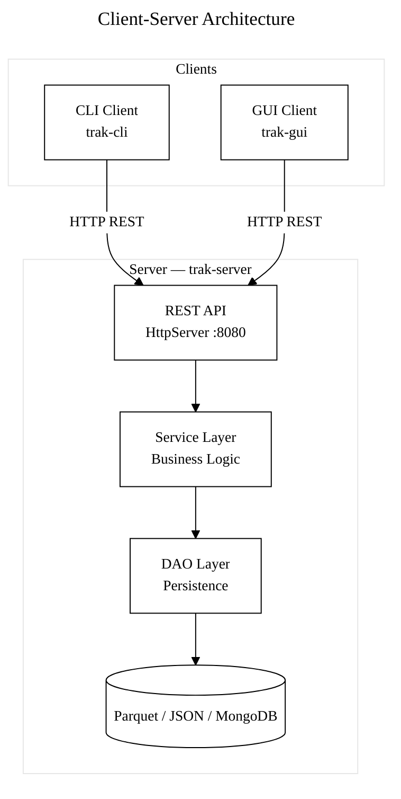

# Trak — Design Document

---

# 1. Problem Statement

Creating and managing a Jira project can be slow and heavyweight, often delaying the start of development work.

Developers need a lightweight, CLI-based sprint and task tracking tool that allows quick project setup, task tracking, and simple workflow management without administrative overhead.

---

# 2. Objective / Goal

Trak provides a minimal but structured system for:

- Sprint tracking
- Backlog management
- Task state management (`Ready`, `In Progress`, `Done`)
- Fast project initialization and lifecycle management
- User authentication and workspace management
- Time tracking per task
- REST API server for multi-client access
- Swing GUI for visual task management

---

# 3. Scope
## In Scope

### Core Product Features
- CLI and GUI clients for project management
- REST API server with token-based authentication
- Sprint and task tracking system
- Task state transitions: Ready, In Progress, Done
- Backlog management
- User management with password authentication
- Session-based login/logout
- Workspace commands (my projects, my tasks, start/end task, time tracking)
- Triple persistence: Parquet (default), JSON, and MongoDB (configurable)
- Seed data generation for testing (`--test` flag)

### Use Case Support
- Project lifecycle management
- Task CRUD operations with time tracking
- Sprint organization
- Backlog task management
- User CRUD with authentication
- GUI: task cards, editable tables, project/member/sprint management dialogs

---

## Out of Scope
  - Notifying Participants
  - Sync with other User Collaboration
---

# 4. System Overview

## System Type
Client-Server Application with CLI, GUI, and REST API

## Core Concept
A task tracking system with three executables:
- **Server** (`trak-server`) — REST API with token-based auth, persists data as Parquet, JSON, or MongoDB
- **CLI Client** (`trak-cli`) — terminal-based client, works locally or against the server
- **GUI Client** (`trak-gui`) — Swing desktop app, works locally or against the server

---

# 5. Functional Requirements

- The system shall allow users to create accounts with password authentication
- The system shall support login/logout with session persistence
- The system shall provide a REST API server with token-based authentication
- The system shall allow users to create and delete projects via CLI or GUI
- The system shall default project owner to the logged-in user (or accept `--owner`)
- The system shall allow task creation with auto-generated IDs, deadlines, and estimates
- The system shall track time spent working on tasks (start/end)
- The system shall allow users to plan sprints linked to projects (with date validation)
- The system shall allow same sprint name across different projects (keyed by ID)
- The system shall allow users to manage backlogs with task assignment
- The system shall allow workspace commands to list user's projects, tasks, and sprints
- The system shall allow marking tasks as COMPLETE via `complete` command
- The system shall display tasks as cards (GUI) or formatted tables (CLI)
- The system shall display sprint details with completed/total task counts
- The system shall maintain state persistently via Parquet, JSON, or MongoDB
- The system shall validate all user inputs
- The system shall display clear success and error messages
- The system shall prompt for confirmation before delete operations
- The system shall provide a guest account created at startup
- The system shall allow archiving (hiding) completed tasks in GUI
- The system shall enforce owner-only permissions for member/task management in GUI
- The system shall support sorting tasks by due date and estimate in GUI
- The system shall support filtering tasks by project in GUI
- The system shall allow seeding test data via `--test` flag (20 users, 10 projects, 1000 tasks, 20 sprints)
- The system shall provide a centralized dark theme (TrakTheme) applied via UIManager defaults
- The system shall provide structured duration input (days/hours/minutes spinners) for task estimates
- The system shall support editing task estimates in the GUI edit dialog
- The system shall use FormPanel for consistent two-column layout in all form dialogs
- The system shall enforce bearer token authentication on all protected REST endpoints (only login, signup, and user creation are public)
- The system shall use request/response DTO records with `validate()` methods for all service operations
- The system shall provide comprehensive error handling: all service calls in controllers wrapped in try-catch, all view-level controller calls wrapped, input validation on all forms
- The system shall support deleting tasks, projects, and sprints from the GUI with confirmation dialogs
- The GUI shall communicate exclusively via HTTP services (no direct import of `task.trak.api`)

---

# 6. Non-Functional Requirements

## Performance
- Command execution should complete within < 500ms (excluding external dependencies)
- System should handle multiple projects efficiently

## Reliability
- Data must persist between sessions
- Graceful handling of invalid inputs and failures

## Usability
- CLI commands must be simple and consistent
- No-args invocation provides guided login/signup flow
- GUI provides visual task cards, editable tables, and action dialogs

## Security
- Passwords stored as SHA-256 hashes (never plaintext)
- Server uses token-based authentication (UUID bearer tokens)
- AuthFilter enforces bearer token on all protected REST endpoints (only login, signup, and user creation are public)
- Session state stored locally in `.store/session.json`

---

# 7. Architecture

## Client-Server Architecture



## Package Structure

```
task.trak.model/            ← Shared types (moved from task.trak.api)
  Session                         Session state
  dto/                            TaskDTO, UserDTO, ProjectDTO, SprintDTO, BacklogDTO
  dto/request/                    CreateTaskRequest, UpdateTaskRequest, etc. (with validate() methods)
  exception/                      TrakException, ValidationException, EntityNotFoundException,
                                  DuplicateEntityException, AuthenticationException (all unchecked)
  util/                           TimeUtil, TeeOutputStream

task.trak.api.service/      ← Service interfaces (only package remaining in api)
  ServiceFactory, TaskService, UserService, ProjectService, SprintService, BacklogService

task.trak.app.server/       ← Server (never imported by client)
  server/                         TrakServer, REST route handlers, AuthFilter
  service/                        TrakTaskService, TrakProjectService, ...
  dao/                            EntityDAO, DAOFactory, SessionDAO
  dao/json/                       JsonTaskDAO, JsonProjectDAO, ...
  dao/parquet/                    ParquetTaskDAO, ParquetProjectDAO, ...
  dao/mongo/                      MongoTaskDAO, MongoProjectDAO, ..., MongoConnection
  model/                          Task, User, Project, Sprint, BackLog
  util/                           PasswordUtil

task.trak.app.client/       ← Client (never imports from server)
  cli/                            TTApp, CLIMain
  cli/cmd/                        CMD_Factory, all CMD classes
  http/                           ApiClient, TaskHttpService, ProjectHttpService, ...
  gui/viewmodel/                  ViewModel, ObservableViewModel, TaskViewModel,
                                  ProjectViewModel, SprintViewModel, UserViewModel
  gui/controller/                 GUIController, AuthController, TaskController,
                                  ProjectController, SprintController
                                  (controllers receive HTTP services via constructor injection)
  gui/view/                       DataView (abstract), MainFrame, TrakTheme, GlassPanel
  gui/view/task/                  TasksView, TaskCardPanel, TaskAddView, TaskEditView, TimeInputPanel
  gui/view/project/               ProjectsView, ProjectCreateView, ProjectAddView
  gui/view/sprint/                SprintView, SprintAddView
  gui/view/auth/                  LoginView, SignUpView, LogOutView
  gui/view/error/                 ErrorView, ErrorAlertView,
                                  UserNameAlreadyExistErrorView,
                                  EmailAlreadyExistErrorView,
                                  TaskBeforeProjectErrorView
  gui/view/form/                  FormDialogView, FormPanel
  gui/view/panel/                 OutputPanel, StatusPanel
  config/                         WorkspaceConfig
```

**Key boundary:** Client code (`app.client`) never imports from server code (`app.server`). Shared types live in `task.trak.model`. GUI communicates exclusively via HTTP services and does not import `task.trak.api`.

## ServiceFactory (Dependency Injection)

`ServiceFactory` in `task.trak.api.service` uses supplier registration:
- `ServiceFactory.registerLocalServices()` — registers direct service implementations (server/local mode)
- `ServiceFactory.registerHttpServices()` — registers HTTP client implementations (remote mode)
- CMD classes call `ServiceFactory.taskService()` etc. — transparent swap, zero code changes
- GUI does not use `ServiceFactory` — controllers receive HTTP services via constructor injection. In `--local` mode, the GUI starts an embedded TrakServer on a random port and connects via HTTP.

## REST API Server

Built on `com.sun.net.httpserver.HttpServer` (JDK built-in). Token-based auth via `SessionManager`. Routes return JSON (Gson).

## GUI (Swing — MVC with Observer Pattern)

The GUI follows a Model-View-Controller architecture with an Observer pattern for reactive updates:

- **ViewModels** (`gui/viewmodel/`): `ObservableViewModel` base class implements `addObserver()`, `removeObserver()`, and `notifyObservers()`. Concrete ViewModels (`TaskViewModel`, `ProjectViewModel`, `SprintViewModel`, `UserViewModel`) implement `Serializable` and persist state to `.cache/`.
- **Controllers** (`gui/controller/`): `GUIController` coordinates domain controllers (`AuthController`, `TaskController`, `ProjectController`, `SprintController`). Controllers invoke the service layer and update ViewModels.
- **Views** (`gui/view/`): `DataView` is an abstract `JPanel` with a `render()` method. Views call `addObserver()` on the ViewModels they depend on and implement `onViewModelChanged()` to re-render. `MainFrame` implements `ViewModelChangeListener`. Views always show user-scoped data.
- **Cross-domain observation**: Views can observe multiple ViewModels. `TasksView` observes both `TaskViewModel` and `ProjectViewModel`. `SprintView` observes `SprintViewModel`, `ProjectViewModel`, and `TaskViewModel`.
- **Flow**: User action --> View --> Controller --> Service --> Controller updates ViewModel --> `notifyObservers()` --> Views call `render()`

Features:
- Task cards with status dropdowns (READY=red, INPROGRESS=yellow, COMPLETE=green)
- Delete tasks (X button on cards), projects, and sprints (Delete button in toolbar) with confirmation dialogs
- Comprehensive error handling: all 40+ service calls in controllers wrapped in try-catch, input validation on all forms
- Editable project/sprint tables with Save button
- Double-click cells for member management, task management, summary editing
- Sort by due date/estimate, filter by project, archive completed tasks
- Login/Signup/Guest dialogs, error alerts
- Dark cinematic theme via TrakTheme (deep charcoal + warm gold accent, 8px spacing grid)
- Structured duration spinners (TimeInputPanel) for task estimate input
- Green CTA button for primary actions (Add Task)
- GlassPanel rounded containers with gradient background and optional drop shadow
- FormPanel two-column layout for all form dialogs
- Task cards with custom-painted rounded corners, gradient background, gold glow hover

---

# 8. Core Data Model

## User
- `id` : Long
- `first_name` : String
- `last_name` : String
- `user_name` : String (lookup key)
- `email` : String (unique)
- `password_hash` : String (SHA-256)
- `tasks` : List\<Long\> (task IDs)
- `projects` : List\<Long\> (project IDs)

## Session
- `logged_in_user` : String (username)
- `current_task_id` : Long (nullable)
- `task_started_at` : Long (epoch ms, nullable)

## Project
- `id` : Long
- `project_name` : String (lookup key)
- `created_at` : Date
- `summary` : String
- `owner` : User (required)
- `members` : List\<User\>
- `back_log` : BackLog
- `sprints` : List\<Sprint\>

## Task
- `id` : Long (auto-generated)
- `project_name` : String (required)
- `assigned_to` : String (username)
- `title` : String (required)
- `status` : STATE (READY | INPROGRESS | COMPLETE)
- `created_at` : Date
- `completed_at` : Date
- `summary` : String
- `deadline` : Date
- `estimate` : String (e.g. "2h", "1d")
- `time_started` : Long (epoch ms)
- `time_spent_ms` : Long (accumulated)

## Sprint
- `id` : Long (auto-generated, primary key)
- `project_name` : String (required)
- `name` : String (not unique — same name allowed across projects)
- `task_ids` : List\<Long\>
- `start_date` : Date (must be >= today)
- `end_date` : Date (must be <= start + 1 year)

## BackLog
- `id` : Long (auto-generated)
- `name` : String (lookup key)
- `project_name` : String (required)
- `task_ids` : List\<Long\>
- `created_at` : Date

---

# 9. Executables & CLI Interface

## Three Executables
```bash
java -jar trak-server [port]              # Start REST API (default :8080)
java -jar trak-cli [--remote] <command>   # CLI (local default, --remote for server)
java -jar trak-gui [--local] [--test]     # GUI (remote default, --local for standalone)
```

## Makefile Targets
```bash
make build          # Build all 3 jars
make build-gui      # Build GUI jar only
make build-cli      # Build CLI jar only
make build-server   # Build server jar only
make test           # Run tests
make clean          # Clean artifacts
make reset          # Clean + remove .store and .cache
make cli            # Build + CLI usage
make cli-test       # Build + quick CLI test
make all            # Build + run tests
make all-test       # Build + run tests + show usage
```

## Authentication
```bash
trak-cli                                  # interactive login/signup prompt
trak-cli login <username> --password <pw>
trak-cli signup <username> --first_name <f> --last_name <l> --email <e> --password <pw>
trak-cli logout
```

## Workspace (requires login)
```bash
trak-cli projects                         # list my projects
trak-cli tasks                            # list my tasks (table)
trak-cli sprints                          # list my sprints
trak-cli detail -s|-p|-t <id>             # full info by sprint/project/task ID
trak-cli cur                              # current task + elapsed time
trak-cli start <task_id>                  # start working (tracks time)
trak-cli end                              # stop working
trak-cli complete <task_id>               # mark task COMPLETE
trak-cli addtask <project>                # interactive task creation
trak-cli addmember <project> <username>   # add member to project
trak-cli sprintplan                       # interactive sprint planning
trak-cli info                             # list all commands
```

## Entity CRUD
```bash
trak-cli user add|get|update|delete
trak-cli project add|get|update|delete
trak-cli task add|get|update|delete       # --project requires numeric ID
trak-cli sprint add|get|update|delete     # get requires ID, update with --project for name
trak-cli backlog add|get|update|delete
```

## REST API Endpoints
```
POST   /api/auth/login|signup|logout
GET|POST|PUT|DELETE  /api/users/{username}
GET|POST|PUT|DELETE  /api/projects/{name}    ?user=
GET|POST|PUT|DELETE  /api/tasks/{id}         ?assignee=
GET|POST|PUT|DELETE  /api/sprints/{id}
GET|POST|PUT|DELETE  /api/backlogs/{name}
```

---

# 10. Storage

Three persistence formats (configurable via `.store/workspace.json`):

### Parquet (default)
| Entity  | File                 |
|---------|----------------------|
| User    | `User.parquet`       |
| Project | `Project.parquet`    |
| Task    | `Task.parquet`       |
| Sprint  | `Sprint.parquet`     |
| Backlog | `Backlog.parquet`    |

### JSON
| Entity  | File pattern             |
|---------|--------------------------|
| User    | `user_{username}.json`   |
| Project | `{project_name}.json`    |
| Task    | `task_{id}.json`         |
| Sprint  | `sprint_{id}.json`       |
| Backlog | `backlog_{name}.json`    |

### MongoDB
| Collection | Key Field      |
|------------|----------------|
| `users`    | `user_name`    |
| `projects` | `project_name` |
| `tasks`    | `id`           |
| `sprints`  | `id`           |
| `backlogs` | `name`         |

Requires environment variables: `MONGO_URI` (connection string), `MONGO_DB` (database name, default: `trak`).

### Always JSON (all formats)
| File | Purpose |
|------|---------|
| `session.json` | Current login session |
| `workspace.json` | Store format config (`"parquet"`, `"json"`, or `"mongo"`) |

---

# 11. Test Coverage

| Suite | Tests |
|-------|-------|
| Authentication Cucumber | 8 |
| Backlog Cucumber | 7 |
| Backlog Unit | 7 |
| CMDTest | 1 |
| Detail Cucumber | 5 |
| Password Cucumber | 3 |
| PasswordUtil Unit | 6 |
| Project Cucumber | 11 |
| Project Store Unit | 7 |
| Project Unit | 6 |
| Seed Data | 1 |
| Service List Unit | 7 |
| Session Unit | 6 |
| Sprint Cucumber | 6 |
| Sprint Unit | 6 |
| Task Cucumber | 6 |
| Task Unit | 16 |
| User Cucumber | 8 |
| User Unit | 12 |
| Workspace Cucumber | 9 |
| ObserverPatternTest | 11 |
| AppModelTest | 18 |
| HttpServicePackageTest | 7 |
| observer.feature (Cucumber) | 5 |
| gui_mvc.feature (Cucumber) | 11 |
| http_package.feature (Cucumber) | 8 |
| **Total** | **~200** |
