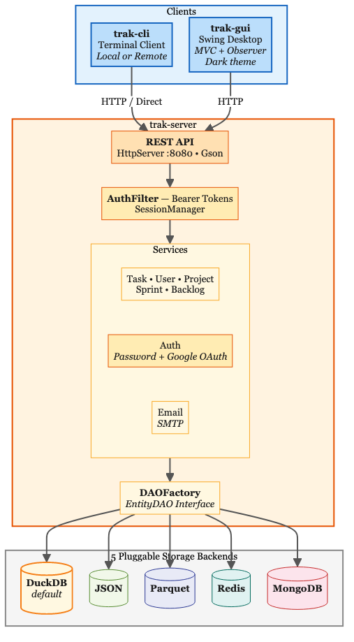
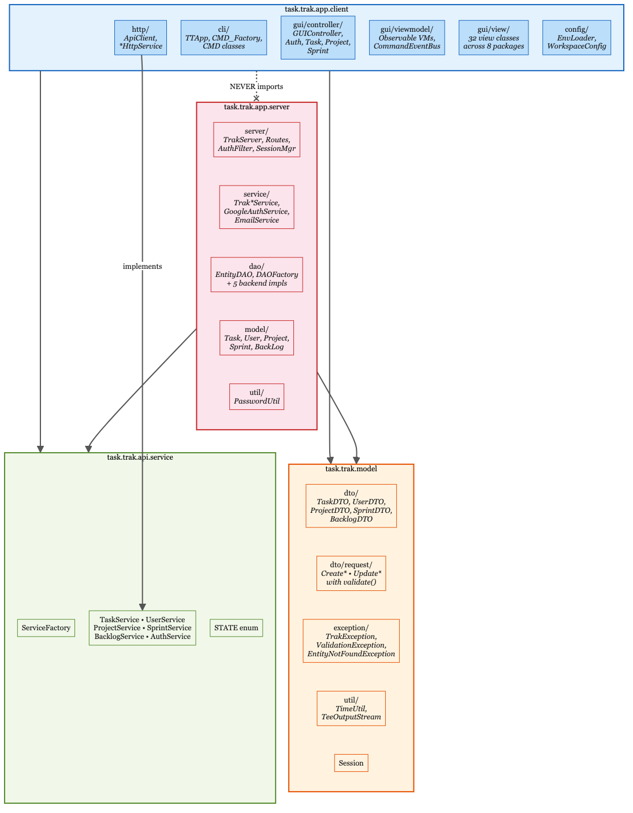
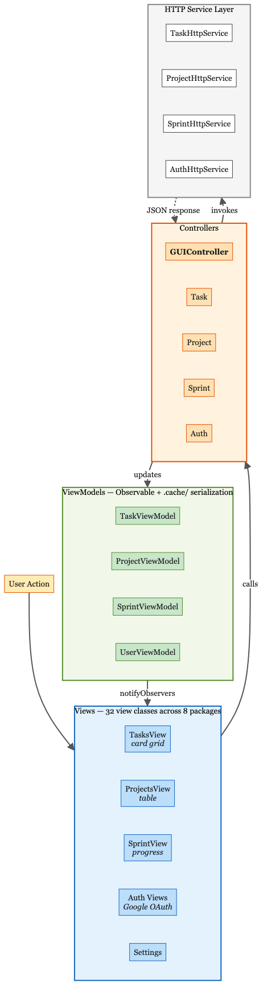
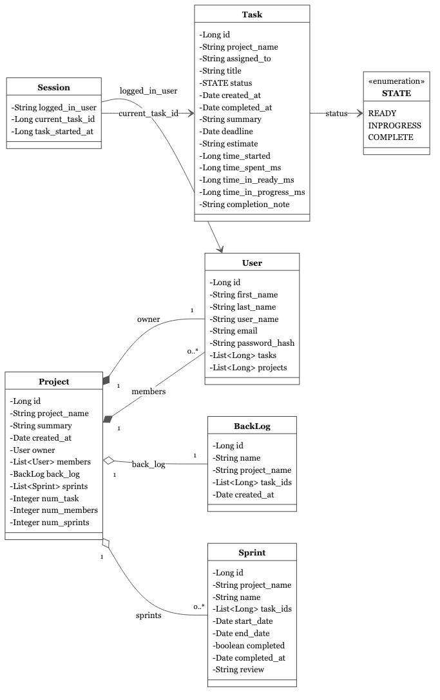

\newpage
\tableofcontents
\newpage

**GitHub:** [https://github.com/magana272/Trak](https://github.com/magana272/Trak)

# 1. Problem Statement

Creating and managing a Jira project can be slow and heavyweight, often delaying the start of development work. Setting up boards, configuring workflows, and navigating complex UIs adds friction before a single line of code is written.

Developers need a lightweight sprint and task tracking tool that allows quick project setup, task tracking, and simple workflow management without administrative overhead.

# 2. Objective

Trak provides a minimal but structured system for:

- Sprint tracking and planning
- Backlog management
- Task state management (Ready, In Progress, Done)
- Fast project initialization and lifecycle management
- User authentication and workspace management
- Time tracking per task with live countdown timers
- REST API server for multi-client access
- Swing GUI for visual task management

# 3. Scope

## In Scope

- CLI and GUI clients for project management
- REST API server with bearer token authentication
- Sprint and task tracking with state transitions
- Backlog management
- User management with password and Google OAuth authentication
- Password reset via email (SMTP)
- Session-based login/logout
- Workspace commands (my projects, my tasks, start/end task, time tracking)
- Five persistence formats: DuckDB (default), JSON, Parquet, Redis, MongoDB
- Seed data generation for testing
- Native installer via jpackage (macOS, Windows, Linux)

## Out of Scope

- Real-time notifications between participants
- Multi-user collaboration sync
- Cloud hosting or SaaS deployment

\newpage

# 4. System Overview

Trak is a client-server application with three executables:

| Executable | Purpose | Default Mode |
|---|---|---|
| `trak-server` | REST API server | Port 8080 |
| `trak-cli` | Command-line client | Local (direct DB) |
| `trak-gui` | Swing desktop client | Remote (needs server) |

- **Server** (`trak-server`) — REST API with bearer token auth, persists data via configurable storage backend
- **CLI Client** (`trak-cli`) — terminal client that works locally (direct DB access via ServiceFactory) or against the server (HTTP)
- **GUI Client** (`trak-gui`) — Swing desktop app that always communicates via HTTP, even in local mode (starts an embedded server on a random port)

{width=85%}

\newpage

# 5. Functional Requirements

## Authentication & Authorization

- Users can create accounts with username, email, and password
- Login/logout with persistent session state (`.store/session.json`)
- Google OAuth login via desktop loopback flow
- Password reset via email (SMTP through Jakarta Mail)
- Guest account (`guest` / `Guest1!`) created automatically at startup
- Bearer token authentication on all protected REST endpoints
- Only login, signup, and user creation endpoints are public

## Project Management

- Create and delete projects via CLI or GUI
- Project owner defaults to logged-in user (or accepts `--owner`)
- Owner-only permissions for member and task management in GUI
- Add/remove project members

## Task Management

- Task creation with auto-generated IDs, deadlines, and estimates
- Task state transitions: READY → INPROGRESS → COMPLETE
- Time tracking: start/end working on tasks, accumulated time per state
- Completion note prompt when marking a task COMPLETE
- Archive (hide) completed tasks in GUI
- Sort by due date or estimate, filter by project
- Focus timer bar on in-progress task cards (green → amber → red)

## Sprint Management

- Plan sprints linked to projects with date validation
- Same sprint name allowed across different projects (keyed by auto-generated ID)
- Sprint completion with review note and timestamp
- Sprint progress tracking (completed vs total task count)
- Sprint deletion and archival

## GUI Features

- Task cards with status dropdowns and color coding
- Editable project/sprint tables with inline editing
- Dark cinematic theme (deep charcoal + warm gold accent)
- Undecorated frame with custom title bar, drag-to-move, edge resize
- Structured duration spinners for task estimate input
- FormPanel two-column layout for all form dialogs
- Settings panel: change password, edit user info, delete account
- First-run setup wizard for storage and connection configuration
- Responsive card grid layout (fill width, min 200×160)

## Data & Storage

- Five pluggable persistence backends (configurable via `workspace.json`)
- DuckDB as default (embedded SQL, zero configuration)
- Seed data generation via `--test` flag (20 users, 10 projects, 1000 tasks, 20 sprints)
- Request/response DTO records with `validate()` methods for all operations

\newpage

# 6. Non-Functional Requirements

## Performance

- Command execution completes within 500ms (excluding external dependencies)
- GUI renders responsively with 1000+ tasks via filtered views
- DuckDB provides single-file embedded SQL with no server overhead

## Reliability

- Data persists between sessions across all five storage backends
- Graceful handling of invalid inputs with clear error messages
- Comprehensive error handling: all service calls in controllers wrapped in try-catch
- All view-level controller calls wrapped with error display

## Usability

- CLI commands are simple and consistent
- No-args CLI invocation provides guided login/signup flow
- GUI provides visual task cards, editable tables, and action dialogs
- Confirmation prompts before all delete operations

## Security

- Passwords stored as SHA-256 hashes (never plaintext)
- UUID bearer tokens for API authentication
- AuthFilter enforces tokens on all protected REST endpoints
- Google OAuth uses standard desktop loopback flow
- Environment secrets loaded via EnvLoader (system env → bundled properties → app support → `.env`)
- Session state stored locally, never transmitted beyond the server

## Portability

- Java 23+ runs on macOS, Windows, Linux
- Native installer via jpackage bundles a JRE (no separate Java install required)
- macOS native support: full-screen, transparent title bar

\newpage

# 7. Architecture

## Package Structure

The codebase is organized into four top-level packages with strict dependency boundaries:

{width=90%}

```
task.trak.model/            ← Shared types
  Session, dto/, dto/request/, exception/, util/

task.trak.api.service/      ← Service interfaces
  ServiceFactory, AuthService, TaskService, UserService,
  ProjectService, SprintService, BacklogService, STATE

task.trak.app.server/       ← Server (never imported by client)
  server/    — TrakServer, Routes, AuthFilter, SessionManager
  service/   — TrakTaskService, TrakProjectService, ...
  service/auth/  — TrakAuthService, GoogleAuthService
  service/email/ — EmailService, SmtpEmailService
  dao/       — EntityDAO, DAOFactory + 5 backend implementations
  model/     — Task, User, Project, Sprint, BackLog
  util/      — PasswordUtil

task.trak.app.client/       ← Client (never imports server)
  cli/       — TTApp, CMD_Factory, CMD classes
  http/      — ApiClient, *HttpService implementations
  gui/       — controller/, viewmodel/, view/ (32 classes, 8 packages)
  config/    — EnvLoader, WorkspaceConfig
```

**Key boundary:** Client code (`app.client`) never imports server code (`app.server`). Shared types live in `task.trak.model`. The GUI communicates exclusively via HTTP services and does not import `task.trak.api`.

## ServiceFactory — Dependency Injection

`ServiceFactory` uses supplier registration for transparent local/remote switching:

- `registerLocalServices()` — registers direct service implementations (server/local mode)
- `registerHttpServices()` — registers HTTP client implementations (remote mode)
- CMD classes call `ServiceFactory.taskService()` — transparent swap, zero code changes
- GUI does not use ServiceFactory — controllers receive service interfaces via constructor injection; `GUIMain` passes HTTP implementations

## REST API Server

Built on `com.sun.net.httpserver.HttpServer` (JDK built-in). Bearer token auth via `SessionManager`. All routes return JSON serialized with Gson.

### Endpoints

| Method | Path | Auth |
|---|---|---|
| POST | `/api/auth/login\|signup\|logout` | Public |
| GET, POST | `/api/users` | POST public, GET protected |
| GET, PUT, DELETE | `/api/users/{username}` | Protected |
| GET, POST | `/api/projects` | Protected |
| GET | `/api/projects/id/{id}`, `/api/projects/name/{name}` | Protected |
| PUT, DELETE | `/api/projects/{name}` | Protected |
| POST | `/api/projects/{name}/members` | Protected |
| GET, POST | `/api/tasks` | Protected |
| GET, PUT, DELETE | `/api/tasks/{id}` | Protected |
| GET, POST | `/api/sprints` | Protected |
| GET, PUT, DELETE | `/api/sprints/{id}` | Protected |
| GET | `/api/sprints/name/{name}` | Protected |
| GET, POST, PUT, DELETE | `/api/backlogs/{name}` | Protected |

## GUI Architecture — MVC with Observer Pattern

The GUI follows Model-View-Controller with an Observer pattern for reactive updates:

{width=65%}

- **ViewModels** — `ObservableViewModel` base class with `addObserver()`, `removeObserver()`, `notifyObservers()`. Concrete ViewModels implement `Serializable` and persist state to `.cache/`.
- **Controllers** — `GUIController` coordinates domain controllers (Auth, Task, Project, Sprint). Controllers invoke the HTTP service layer and update ViewModels.
- **Views** — `DataView` is an abstract `JPanel` with a `render()` method. Views register as observers on the ViewModels they depend on and re-render on change.
- **Cross-domain observation** — Views can observe multiple ViewModels. `TasksView` observes both `TaskViewModel` and `ProjectViewModel`. `SprintView` observes three ViewModels.
- **Flow:** User action → View → Controller → HTTP Service → Controller updates ViewModel → `notifyObservers()` → Views call `render()`

\newpage

# 8. Data Model

{width=95%}

## Entities

**User** — `id`, `first_name`, `last_name`, `user_name` (lookup key), `email` (unique), `password_hash` (SHA-256), `tasks` (List\<Long\>), `projects` (List\<Long\>)

**Session** — `logged_in_user` (username), `current_task_id` (nullable), `task_started_at` (epoch ms, nullable)

**Project** — `id`, `project_name` (lookup key), `created_at`, `summary`, `owner` (User), `members` (List\<User\>), `back_log` (BackLog), `sprints` (List\<Sprint\>), `num_task`, `num_members`, `num_sprints`

**Task** — `id` (auto-generated), `project_name`, `assigned_to`, `title`, `status` (STATE enum), `created_at`, `completed_at`, `summary`, `deadline`, `estimate`, `time_started`, `time_spent_ms`, `time_in_ready_ms`, `time_in_progress_ms`, `completion_note`

**Sprint** — `id` (auto-generated), `project_name`, `name`, `task_ids` (List\<Long\>), `start_date`, `end_date`, `completed`, `completed_at`, `review`

**BackLog** — `id` (auto-generated), `name` (lookup key), `project_name`, `task_ids` (List\<Long\>), `created_at`

**STATE** (enum) — `READY`, `INPROGRESS`, `COMPLETE`

## DTOs and Request Records

All data crossing the HTTP boundary uses DTOs (Java records). Server models are internal and never exposed to clients. Request records include a `validate()` method that throws `ValidationException` on invalid input:

- `CreateTaskRequest`, `UpdateTaskRequest`
- `CreateProjectRequest`, `UpdateProjectRequest`
- `CreateSprintRequest`, `UpdateSprintRequest`
- `CreateUserRequest`, `UpdateUserRequest`
- `CreateBacklogRequest`

## Exception Hierarchy

All exceptions extend `RuntimeException` (unchecked):

- `TrakException` — base exception
  - `ValidationException` — bad input or constraint violation → HTTP 400
  - `EntityNotFoundException` — missing entity → HTTP 404

Route handlers catch `TrakException` subclasses and map them to HTTP status codes (400, 401, 404, 409).

\newpage

# 9. Storage

Five persistence backends are configurable via `.store/workspace.json`:

| Backend | Config Value | Storage Location | Notes |
|---|---|---|---|
| **DuckDB** | `"duckdb"` | `.store/trak.duckdb` | Default. Embedded SQL, zero config |
| **JSON** | `"json"` | `.store/*.json` | One file per entity |
| **Parquet** | `"parquet"` | `.store/*.parquet` | Avro + Snappy compression |
| **Redis** | `"redis"` | `trak:*` keys | Requires `REDIS_URL` env var |
| **MongoDB** | `"mongo"` | Collections | Requires `MONGO_URI`, `MONGO_DB` |

The `DAOFactory` reads `workspace.json` at startup and instantiates the matching DAO implementations. All backends implement the same `EntityDAO` interface, so switching storage is a one-line config change.

Session state (`session.json`) and workspace config (`workspace.json`) are always stored as JSON regardless of the chosen backend.

\newpage

# 10. Design Decisions

## Why Client-Server Instead of Monolithic

The CLI initially worked as a monolithic app with direct DB access. Once the GUI was added, sharing state between two running clients required a server. The client-server split also enabled:

- Multiple clients (CLI + GUI) running simultaneously against the same data
- Clean separation of concerns: clients handle presentation, server handles business logic and persistence
- The GUI always communicates via HTTP, even in local mode — it starts an embedded server on a random port, ensuring a single code path for all GUI operations

## Why JDK HttpServer Instead of Spring or Jetty

Trak is a lightweight tool. Adding Spring Boot or Jetty would multiply the jar size and startup time for a simple CRUD API. `com.sun.net.httpserver.HttpServer` is built into the JDK, adds zero dependencies, starts in milliseconds, and is sufficient for the route count (~20 endpoints). The tradeoff is manual route registration and JSON parsing, but that keeps the server code explicit and easy to follow.

## Why Five Storage Backends

The DAOFactory pattern was introduced to explore different persistence strategies and their tradeoffs. Each backend serves a different purpose:

- **DuckDB** — default, zero-config embedded SQL. Best balance of features and simplicity
- **JSON** — human-readable, easy to inspect and debug during development
- **Parquet** — columnar format, efficient for analytical queries on large datasets
- **Redis** — in-memory, fast for read-heavy workloads with a running server
- **MongoDB** — document store, natural fit for the JSON-like entity structure

All five implement the same `EntityDAO` interface. Switching backends is a one-line config change in `workspace.json`.

## Why MVC + Observer Pattern for the GUI

Swing does not provide built-in data binding. The Observer pattern bridges the gap: ViewModels notify registered Views when data changes, so the UI stays in sync without polling or manual refresh calls. This also enables cross-domain observation — `SprintView` observes three ViewModels (Sprint, Project, Task) and re-renders when any of them change.

Controllers sit between Views and the HTTP service layer, keeping business logic out of the UI code. ViewModels serialize to `.cache/` so the GUI can restore its last state on relaunch.

## Why Strict Package Boundaries

The `app.client` package never imports from `app.server`. This is enforced by convention and tested. The benefit is that the client and server can be built and distributed as separate jars with no risk of accidentally bundling server internals into the client. Shared types (DTOs, service interfaces, exceptions) live in `task.trak.model` and `task.trak.api.service`.

## Why Bearer Tokens Instead of Session Cookies

Bearer tokens (UUID strings) are simpler to implement across both CLI and GUI clients. The CLI stores the token in `session.json` and sends it in the `Authorization` header. The GUI does the same. No cookie management, no CSRF concerns, no browser-specific behavior to handle.

## Why Request DTOs with validate()

Each request record (e.g., `CreateTaskRequest`) includes a `validate()` method that throws `ValidationException`. This keeps validation logic co-located with the data it validates, ensures every route handler validates input consistently, and makes validation rules testable in isolation. The pattern avoids scattering validation across controllers and services.

## Why Google OAuth + Password Auth

Password auth is the baseline — it works offline and requires no external dependencies. Google OAuth was added for convenience: users with Google accounts can sign in with one click instead of creating a separate Trak account. The desktop loopback OAuth flow (redirect to `localhost`) avoids needing a public callback URL.

## Why Undecorated Frame with Custom Title Bar

The default Swing title bar looks dated and varies across platforms. A custom title bar with drag-to-move and edge-resize gives the GUI a modern, consistent look on all platforms. On macOS, the app additionally uses native full-screen and transparent title bar APIs for platform-native behavior.

\newpage

# 11. Testing Strategy

## Approach

Testing combines **Cucumber BDD scenarios** for behavior verification with **JUnit unit tests** for isolated component testing. Cucumber tests are written in Gherkin (`.feature` files) and verify end-to-end flows through the service layer. Unit tests cover individual classes and edge cases.

## Test Coverage

| Category | Suite | Tests |
|---|---|---|
| **Auth** | Authentication Cucumber | 8 |
| | Password Cucumber | 3 |
| | PasswordUtil Unit | 6 |
| **Task** | Task Cucumber | 6 |
| | Task Unit | 16 |
| **Project** | Project Cucumber | 11 |
| | Project Unit | 6 |
| | Project Store Unit | 7 |
| **Sprint** | Sprint Cucumber | 6 |
| | Sprint Unit | 6 |
| **Backlog** | Backlog Cucumber | 7 |
| | Backlog Unit | 7 |
| **User** | User Cucumber | 8 |
| | User Unit | 12 |
| **Workspace** | Workspace Cucumber | 9 |
| | Detail Cucumber | 5 |
| | Service List Unit | 7 |
| | Session Unit | 6 |
| **GUI/Architecture** | ObserverPatternTest | 11 |
| | AppModelTest | 18 |
| | HttpServicePackageTest | 7 |
| | observer.feature (Cucumber) | 5 |
| | gui_mvc.feature (Cucumber) | 11 |
| | http_package.feature (Cucumber) | 8 |
| **Other** | CMDTest | 1 |
| | Seed Data | 1 |
| **Total** | | **~200** |

## What Gets Tested

- **Cucumber BDD** — User-facing flows: authentication, CRUD operations for all entities, workspace commands, sprint planning, time tracking. Written as Given/When/Then scenarios that exercise the service layer end-to-end.
- **Unit tests** — Individual model classes, DTO validation, password hashing, time utilities, session management. Test edge cases and error paths.
- **Architecture tests** — Verify package boundaries (client never imports server), observer pattern behavior, HTTP service interface compliance. These prevent structural regressions.
- **Seed data test** — Verifies that the `--test` flag generates the expected volume (20 users, 10 projects, 1000 tasks, 20 sprints) without errors.

## Running Tests

```bash
make test    # Gradle test task — runs all Cucumber + JUnit suites
```
