# Trak — Diagrams

## Client-Server Architecture

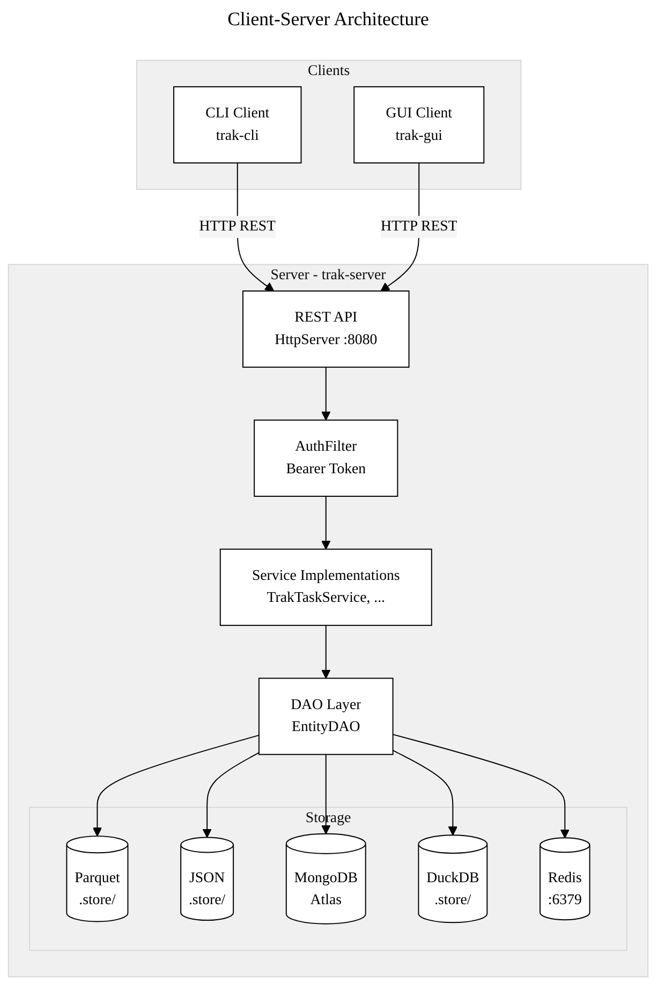

## Models

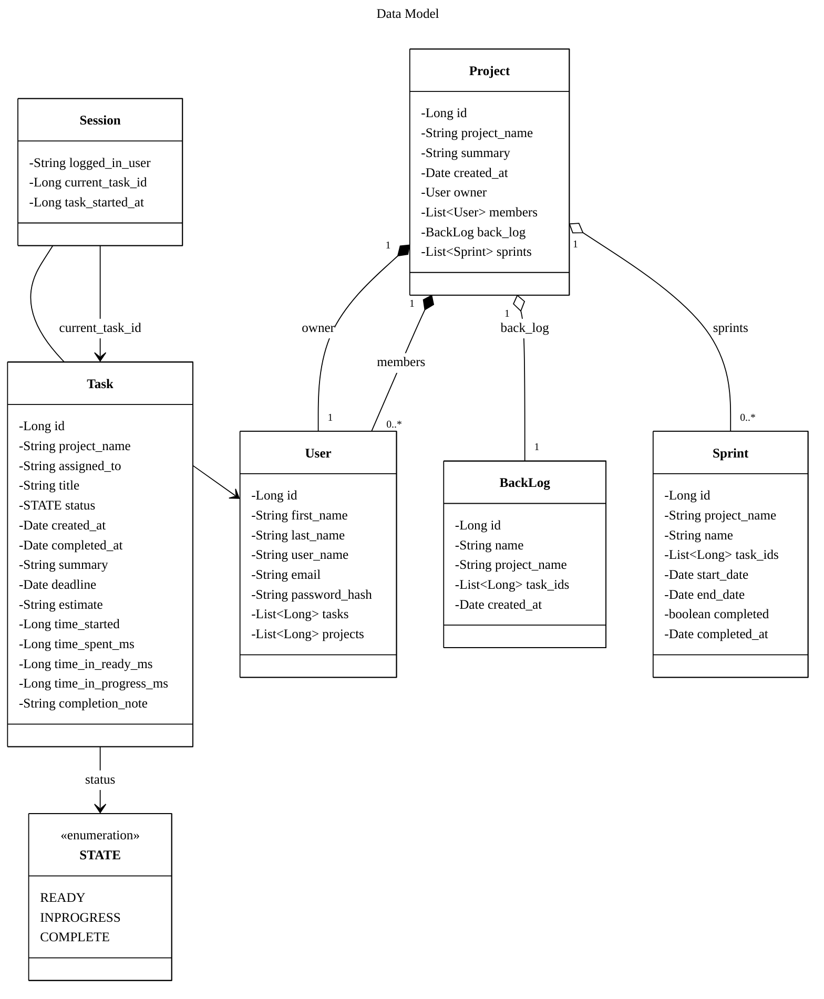

## Package Boundaries

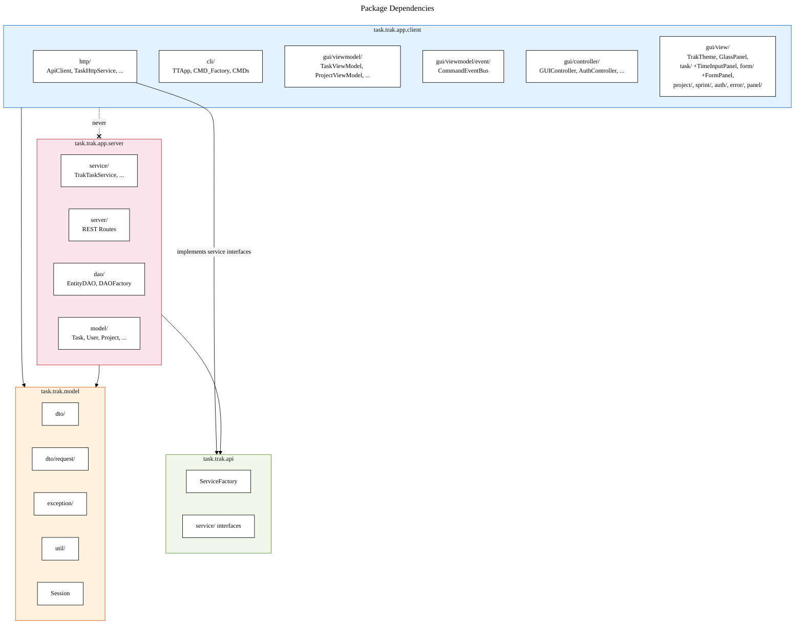

## ServiceFactory Flow

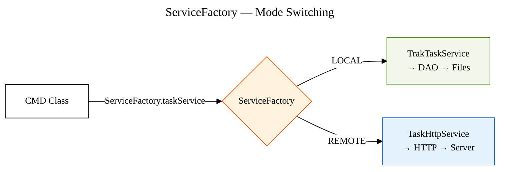

## AuthFilter

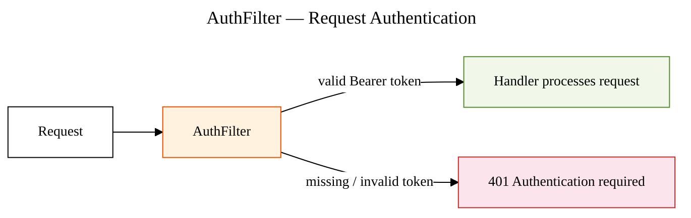

## GUI MVC Observer Pattern

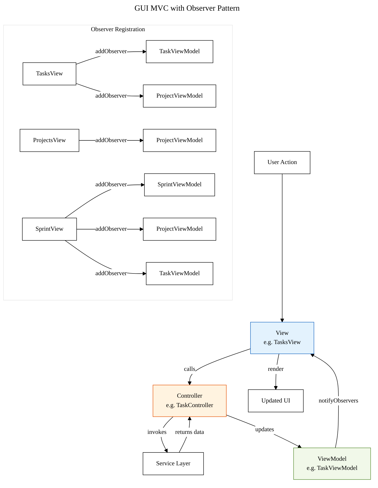

## Theme System

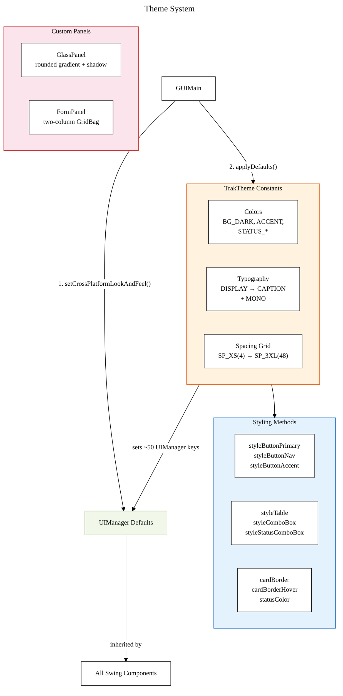

## Command Routing

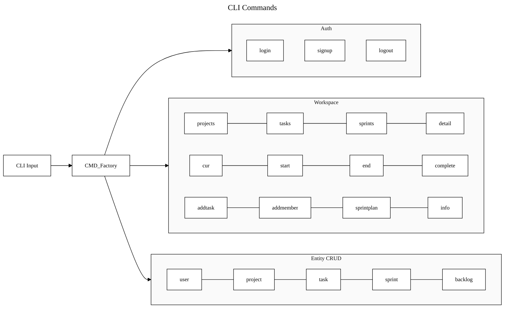

## REST API

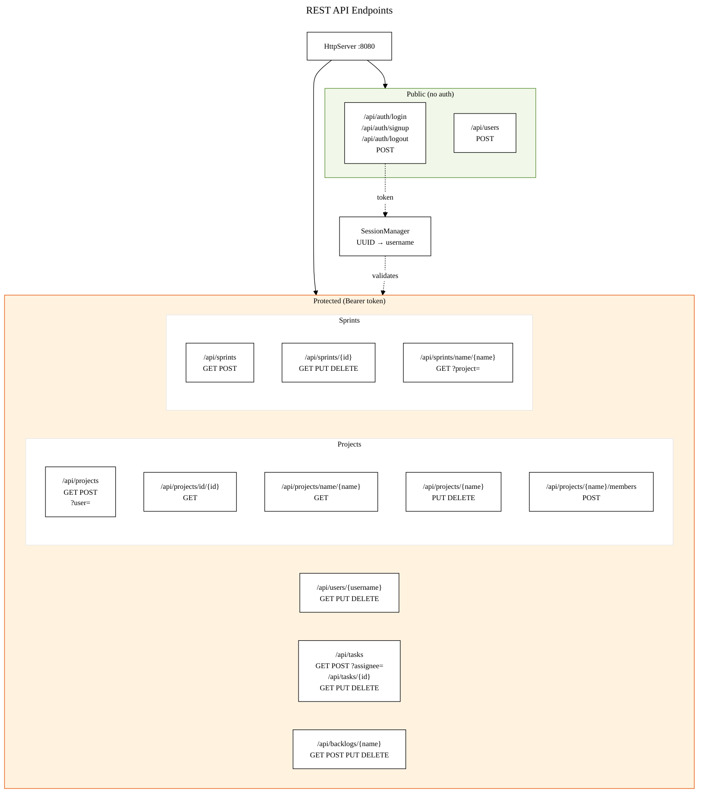

## Storage Backends

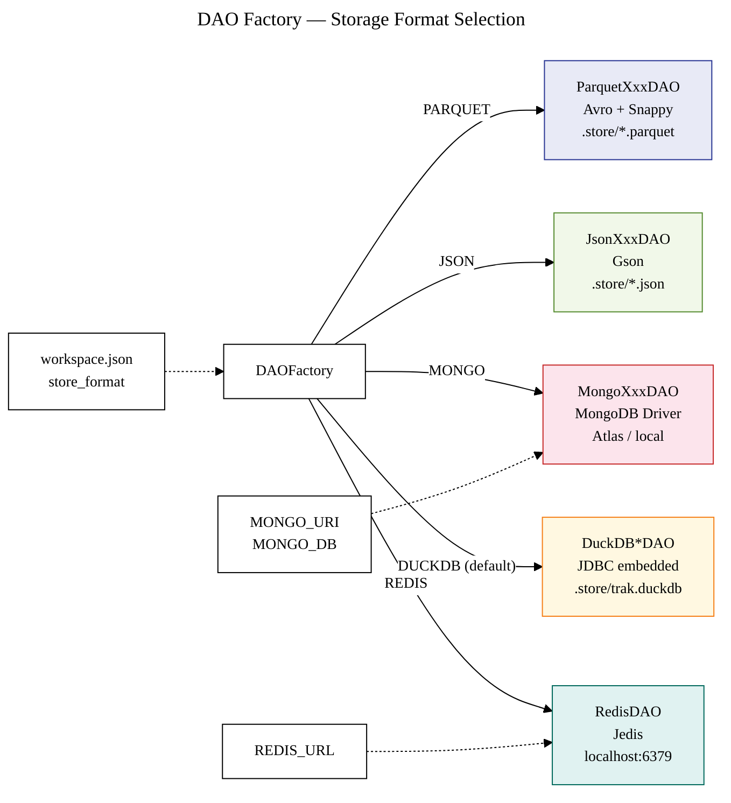

## Sprint Identity

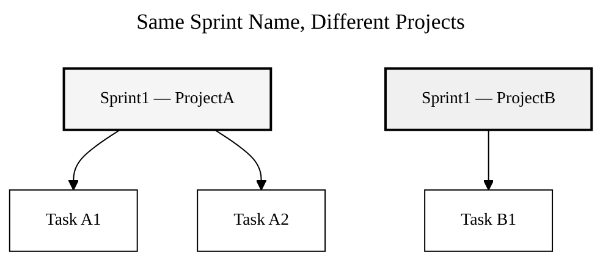

Sprints are keyed by auto-generated ID, not by name.
Two projects can each have a sprint named "Sprint1".
Storage format depends on the configured backend (see Storage Backends diagram).

## Local vs Remote Mode

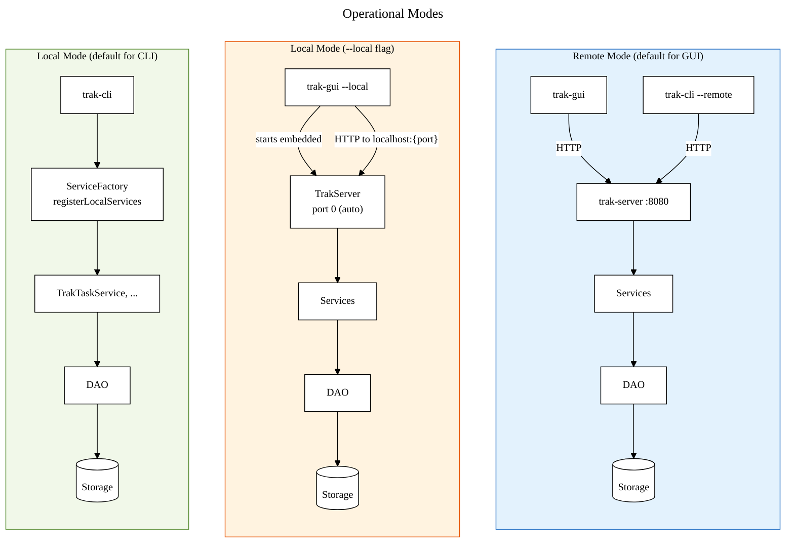

The GUI always communicates via HTTP — even in `--local` mode, it starts an embedded server on a random port and connects to it. The CLI in local mode bypasses HTTP entirely and calls services directly via `ServiceFactory`.

## DTO & Request/Response Flow

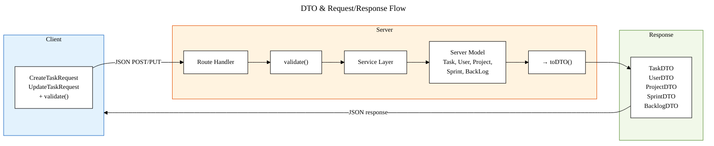

Request DTOs are Java records with a `validate()` method that throws `ValidationException` on invalid input. Server models are internal — only DTOs cross the HTTP boundary.

## Exception Hierarchy

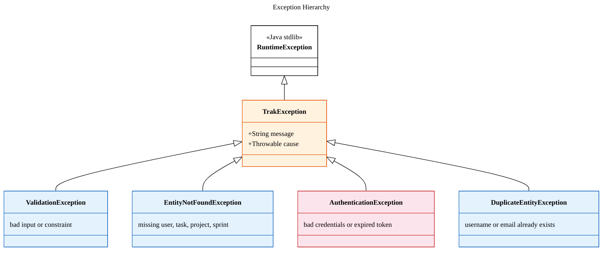

All exceptions are unchecked (`RuntimeException`). Route handlers catch `TrakException` subclasses and map them to HTTP status codes (400, 401, 404, 409).
