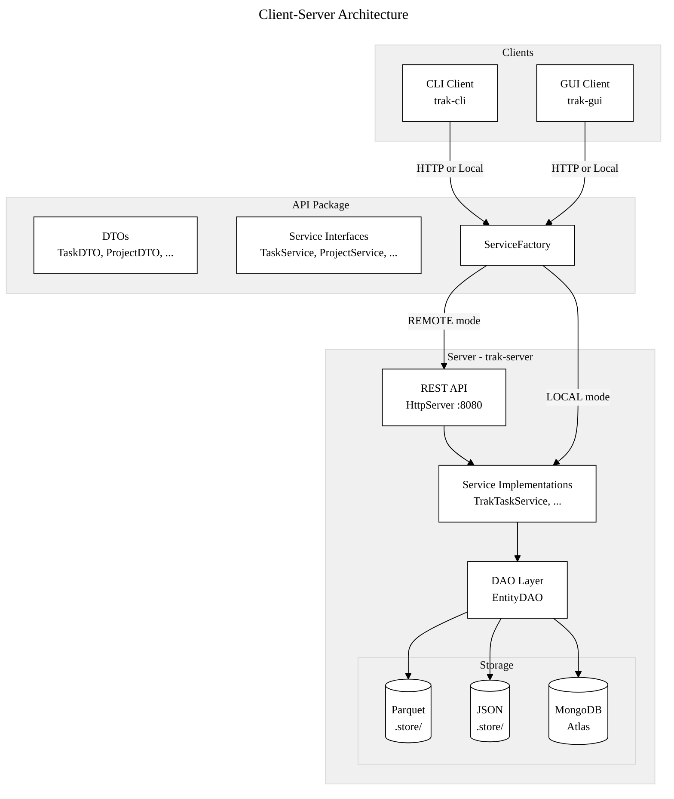
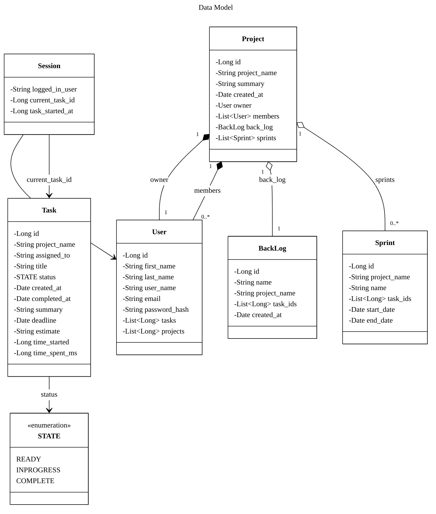
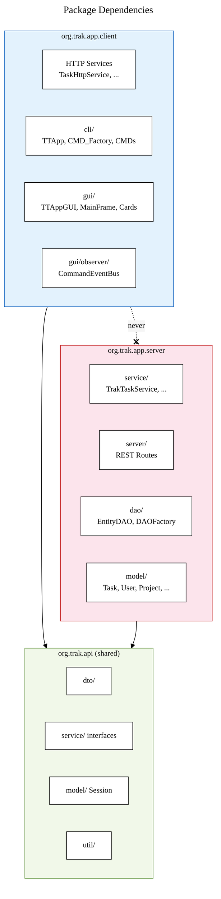
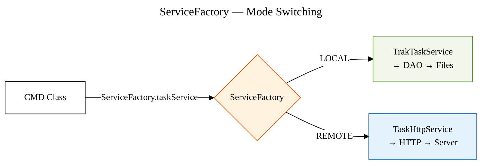
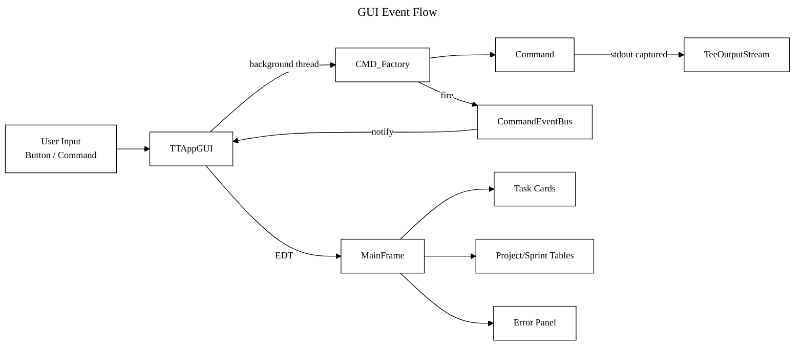
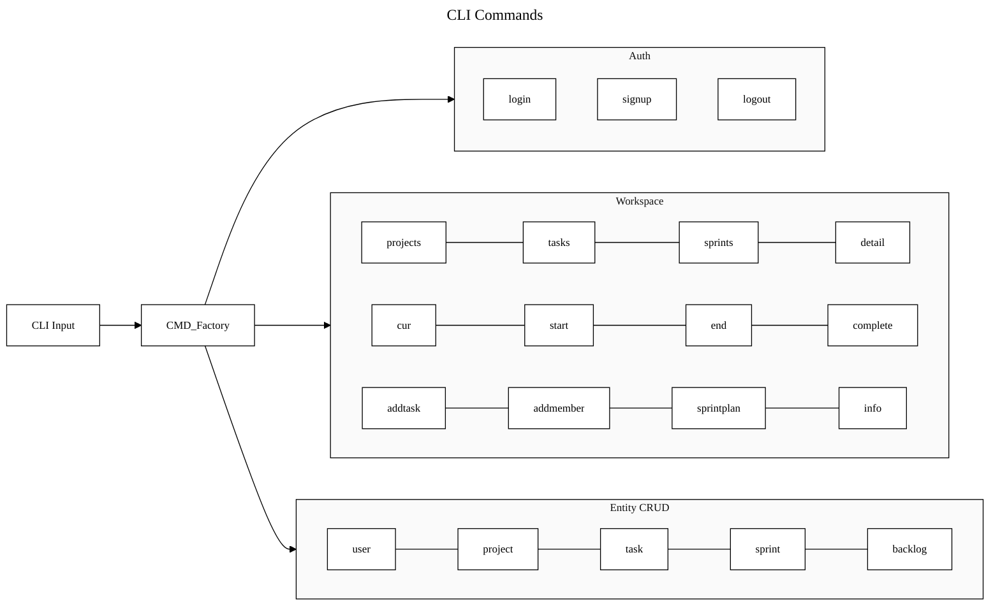
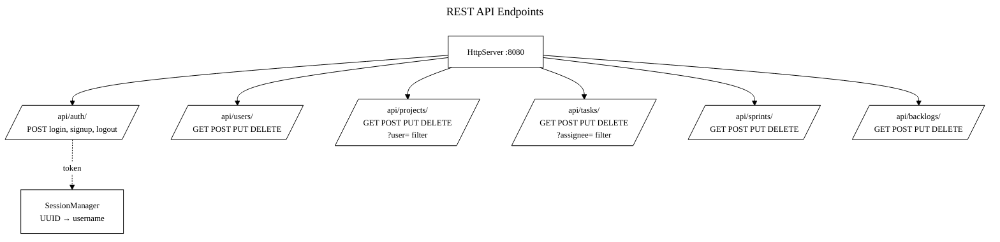
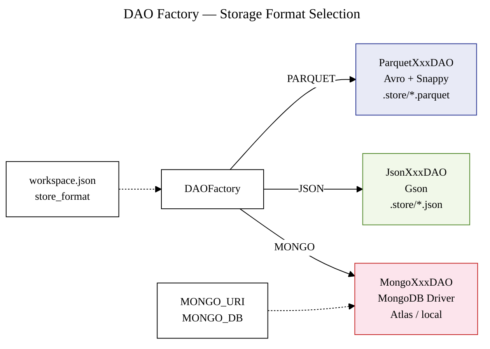
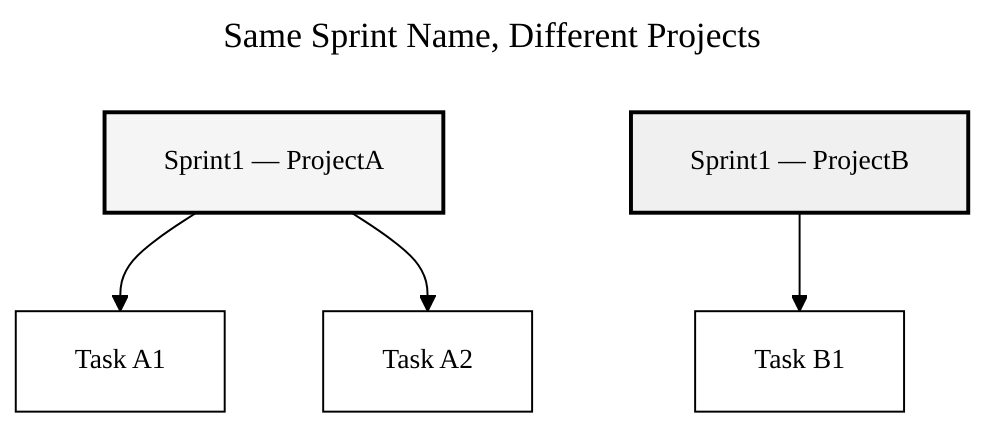

# Trak — Diagrams

## Client-Server Architecture

## Models

## Package Boundaries

## ServiceFactory Flow

## GUI Observer Pattern

## Command Routing

## REST API

## Storage Backends

## Sprint Identity

Sprints are keyed by auto-generated ID, not by name.
Two projects can each have a sprint named "Sprint1".
Stored as `sprint_{id}.json`.
