# Change Document: GUI MVC Refactoring & HTTP Service Package Move

## Summary

The GUI layer (`task.trak.app.client.gui`) has directories named `model/`, `view/`, `controller/` but does not follow
MVC. The `model/` package contains only event infrastructure, views call services directly and hold their own state, and
the controller mixes concerns. Additionally, all HTTP service classes sit flat in `task.trak.app.client` without a
dedicated subpackage.

This change refactors the GUI to properly implement MVC as a **presentation layer** pattern, with clear separation from
the Service and Data Access layers that already exist.

---

## Application Layers

MVC is strictly the **Presentation Layer**. Services and DAOs are independent layers beneath it. An MVC application
includes Services and DAOs, but they are not part of MVC itself.

```
Presentation Layer (MVC -- what this refactoring changes)
  --> Views
  --> ViewModels
  --> Controllers

Service Layer (already exists -- not changing)
  --> Business logic
  --> Uses data access interfaces

Data Access Layer / DAOs (already exists -- not changing)
  --> Contracts (interfaces) for persistent storage
  --> Interface implementations

Entities (already exist -- not changing)
  --> POJO/records that represent data (TaskDTO, ProjectDTO, etc.)
```

### How the layers interact

```
User --> View --> Controller --> Service --> DAO
                      |
                  ViewModel (presentation state)
                      |
                  View (notification --> re-render)
```

- **Controllers** call the Service layer for business logic
- **Controllers** store results in ViewModels (presentation state)
- **ViewModels** notify Views of state changes (Observer pattern)
- **Views** register as Observers on ViewModels they depend on -- including cross-domain ViewModels
- **Views** access `GUIController` for cross-domain controllers/ViewModels
- **Views** re-render automatically when their observed ViewModels fire changes
- **Service layer** is reusable regardless of GUI/client (CLI, GUI, remote API all share it)
- **DAO layer** abstracts persistence (JSON, Parquet, MongoDB)

---

## Current Architecture

### Problems

| Location                                  | Violation                                                                                                                                |
|-------------------------------------------|------------------------------------------------------------------------------------------------------------------------------------------|
| `gui/model/`                              | Contains only event infra (`CommandEvent`, `CommandEventBus`) -- no presentation state                                                   |
| `gui/controller/TTAppGUI.java`            | Holds `Session` state, seeds test data, implements `App` -- mixes ViewModel and Controller                                               |
| `gui/view/ContentPanel.java` (1272 lines) | Calls `ServiceFactory` directly in 6 places; holds state fields; contains task/project/sprint rendering AND all dialog logic in one file |
| `gui/view/TaskCardPanel.java:170`         | Calls `ServiceFactory.projectService()` to populate assignee dropdown                                                                    |
| `gui/view/MainFrame.java`                 | `displayCommandResult()` contains routing/dispatch logic -- controller work                                                              |
| `gui/view/StatusPanel.java`               | Contains `showLoginDialog()` and `showSignupDialog()` -- form logic in a status bar                                                      |
| `task.trak.app.client.*HttpService`       | 7 HTTP classes sit in flat client package alongside CLI, GUI, and config                                                                 |

### Current Architecture Diagram

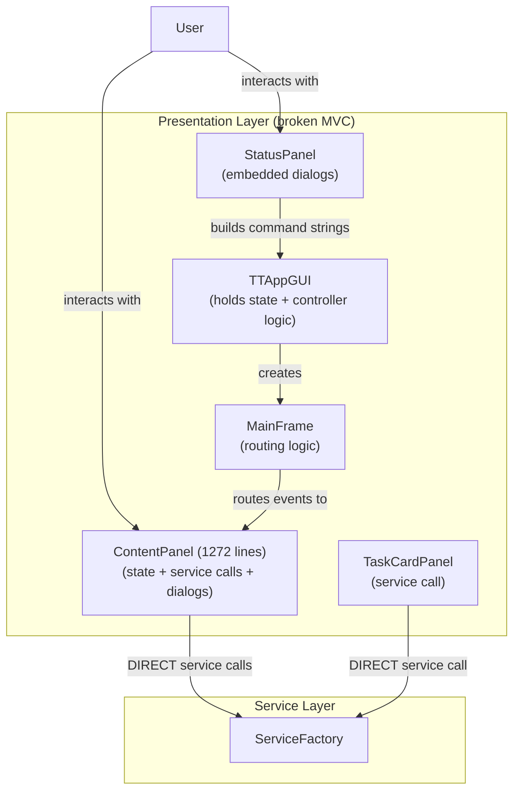

---

## Target Architecture

Following classic MVC as a **presentation layer** pattern (Oracle Java SE MVC): **the user interacts with the View**.
The View delegates to the Controller. The Controller calls the Service layer for business logic, stores results in the
ViewModel. The ViewModel notifies the View. The View re-renders.

### Target Layered Architecture Diagram

```
┌─────────────────────────────────────────────────────────────────────────────┐
│                                 User                                        │
└─────────────────────────────────┬───────────────────────────────────────────┘
                                  │ interacts with
┌─────────────────────────────────▼───────────────────────────────────────────┐
│ Views                                                                       │
│                                                                             │
│  MainFrame    TasksView    ProjectsView    SprintView    StatusPanel        │
│  TaskAddView  TaskEditView ProjectCreateView ProjectAddView SprintAddView   │
│  LoginView    SignUpView   LogOutView       ErrorView    OutputPanel        │
│  TaskCardPanel CommandInputPanel                                            │
│  UserNameAlreadyExistErrorView  EmailAlreadyExistErrorView                  │
│  TaskBeforeProjectErrorView                                                 │
└─────────────────────────────────┬──────────────────────────▲────────────────┘
                    delegates     │                          │ notifies
┌─────────────────────────────────▼──────────────────────────┤────────────────┐
│ ViewModels                                                 │                │
│                                                                             │
│  TaskViewModel    ProjectViewModel    SprintViewModel    UserViewModel      │
└────────────────────────────────────────────────────────────▲────────────────┘
                                                             │ stores results
┌────────────────────────────────────────────────────────────┤────────────────┐
│ Controllers                                                │                │
│                                                                             │
│  GUIController    AuthController    TaskController                          │
│  ProjectController    SprintController                                      │
└─────────────────────────────────┬───────────────────────────────────────────┘
                           calls  │
┌─────────────────────────────────▼───────────────────────────────────────────┐
│ Service Layer (Business Logic)                                              │
│                                                                             │
│  ServiceFactory    TaskService    ProjectService    SprintService           │
│  AuthService       UserService    BacklogService                            │
└─────────────────────────────────┬───────────────────────────────────────────┘
                      persists    │
┌─────────────────────────────────▼───────────────────────────────────────────┐
│ Data Access Layer (Persistence)                                             │
│                                                                             │
│  DAOFactory    EntityDAO                                                    │
│  JsonDAO       ParquetDAO       MongoDAO                                    │
└─────────────────────────────────┬───────────────────────────────────────────┘
                      returns     │
┌─────────────────────────────────▼───────────────────────────────────────────┐
│ Entities (POJOs)                                                            │
│                                                                             │
│  TaskDTO    ProjectDTO    SprintDTO    UserDTO    Session                   │
└─────────────────────────────────────────────────────────────────────────────┘
```

---

## UML Class Diagrams

### Color Legend

| Color  | Meaning                                                      |
|--------|--------------------------------------------------------------|
| Blue   | Interfaces                                                   |
| Orange | Abstract classes                                             |
| Green  | ViewModel classes (extend ObservableViewModel)               |
| Red    | Controller classes (presentation layer)                      |
| Purple | Data view classes (extend DataView / JPanel)                 |
| Pink   | Form dialog views (extend FormDialogView)                    |
| Gray   | Error alert views (extend ErrorAlertView)                    |
| Teal   | Service interfaces (service layer -- existing, not changing) |

---

### UML 1: ViewModel Layer (Presentation State)

ViewModels are **presentation state containers** -- they hold data for the Views and notify on changes. They contain no
business logic. Business logic is in the Service layer.

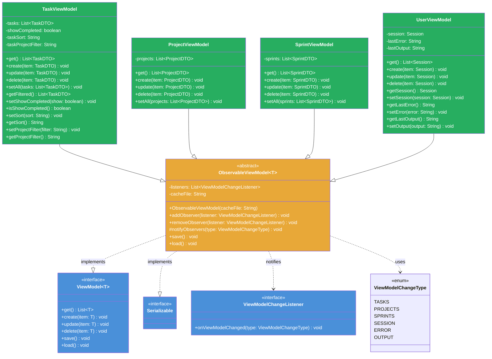

ViewModels are serialized to `.cache/` directory:
- `.cache/task_viewmodel.ser`
- `.cache/project_viewmodel.ser`
- `.cache/sprint_viewmodel.ser`
- `.cache/user_viewmodel.ser`

---

### UML 1.1: Event Infrastructure (presentation/event)

Existing event bus shared with CLI. Stays functional, moves to `viewmodel/event/` subpackage.

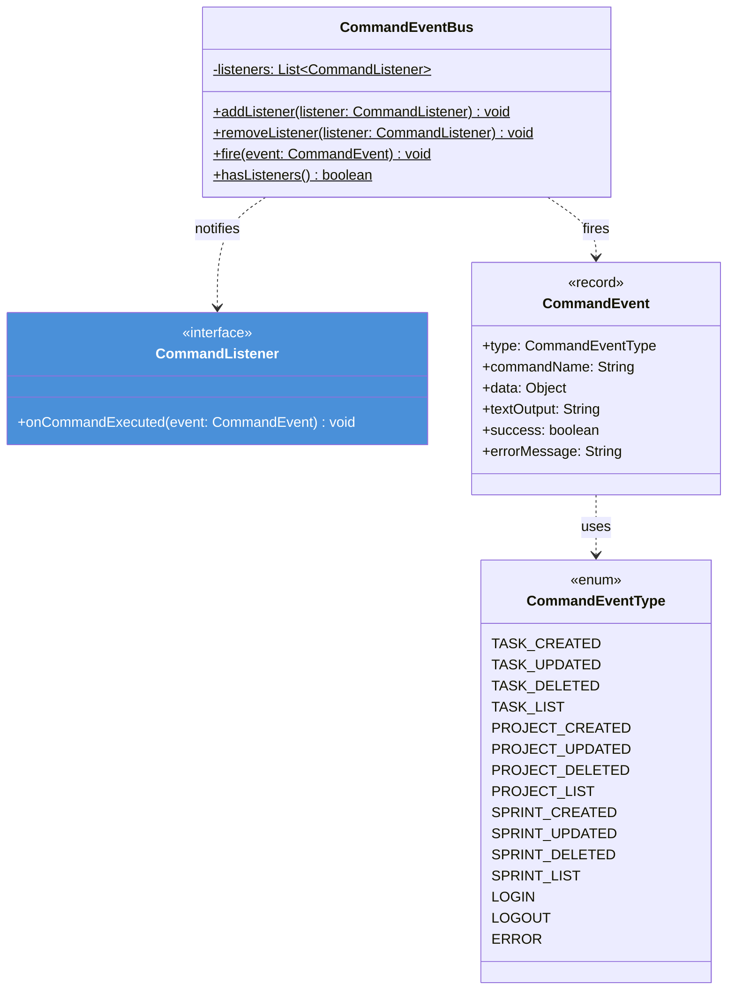

---

### UML 2: Controller Layer (Presentation)

Controllers are **thin pass-throughs** in the presentation layer. They receive user actions from Views, call the Service
layer for business logic, and store results in ViewModels. Controllers contain zero business logic.

```mermaid
classDiagram
    direction TB

    class App {
        <<interface>>
        +save() void
        +getSession() Session
        +setSession(session: Session) void
    }
    style App fill: #4a90d9, color: #fff

    class CommandListener {
        <<interface>>
        +onCommandExecuted(event: CommandEvent) void
    }
    style CommandListener fill: #4a90d9, color: #fff

    class ViewModel~T~ {
        <<interface>>
        +get() List~T~
        +create(item: T) void
        +update(item: T) void
        +delete(item: T) void
        +save() void
        +load() void
    }
    style ViewModel fill: #4a90d9, color: #fff

    class TaskService {
        <<interface>>
        +create(title, project, assignee, summary, deadline, estimate) TaskDTO
        +getById(id: long) TaskDTO
        +updateById(id, title, status, assignee, summary) TaskDTO
        +deleteById(id: long) void
        +listAll() List~TaskDTO~
        +listByAssignee(username: String) List~TaskDTO~
    }
    style TaskService fill: #16a085, color: #fff

    class ProjectService {
        <<interface>>
        +create(name, summary, owner, members) ProjectDTO
        +getByName(name: String) ProjectDTO
        +update(name, newName, summary, members) ProjectDTO
        +delete(name: String) void
        +listAll() List~ProjectDTO~
        +listByUser(username: String) List~ProjectDTO~
    }
    style ProjectService fill: #16a085, color: #fff

    class SprintService {
        <<interface>>
        +create(name, project) SprintDTO
        +updateByNameAndProject(name, project, start, end) SprintDTO
        +updateTaskIds(id, taskIds) SprintDTO
        +delete(id: String) void
        +listAll() List~SprintDTO~
    }
    style SprintService fill: #16a085, color: #fff

    class AuthService {
        <<interface>>
        +login(username, password) Session
        +signup(firstName, lastName, username, email, password) void
        +logout() void
    }
    style AuthService fill: #16a085, color: #fff

    class GUIController {
        -authController: AuthController
        -taskController: TaskController
        -projectController: ProjectController
        -sprintController: SprintController
        -commandExecutor: ExecutorService
        +GUIController(authCtrl, taskCtrl, projectCtrl, sprintCtrl)
        +executeCommand(input: String) void
        +onCommandExecuted(event: CommandEvent) void
        +save() void
        +getSession() Session
        +setSession(session: Session) void
        +getAuthController() AuthController
        +getTaskController() TaskController
        +getProjectController() ProjectController
        +getSprintController() SprintController
    }
    style GUIController fill: #c0392b, color: #fff

    class AuthController {
        -userViewModel: UserViewModel
        +AuthController(userViewModel: UserViewModel)
        +login(username: String, password: String) void
        +signup(username, firstName, lastName, email, password) void
        +logout() void
        +isLoggedIn() boolean
        +getSession() Session
    }
    style AuthController fill: #c0392b, color: #fff

    class TaskController {
        -taskViewModel: TaskViewModel
        +TaskController(taskViewModel: TaskViewModel)
        +addTask(title, projectId, assignee, summary, deadline, estimate) void
        +updateTask(id, title, status, assignee, summary) void
        +deleteTask(id: long) void
        +completeTask(id: long) void
        +refreshTasks() void
        +getTaskById(id: long) TaskDTO
    }
    style TaskController fill: #c0392b, color: #fff

    class ProjectController {
        -projectViewModel: ProjectViewModel
        +ProjectController(projectViewModel: ProjectViewModel)
        +addProject(name: String, summary: String) void
        +updateProject(name, newName, summary) void
        +deleteProject(name: String) void
        +addMember(projectName: String, username: String) void
        +removeMember(projectName, members) void
        +refreshProjects() void
        +getProjectsForUser(username: String) List~ProjectDTO~
        +getProjectMembers(projectName: String) List~String~
    }
    style ProjectController fill: #c0392b, color: #fff

    class SprintController {
        -sprintViewModel: SprintViewModel
        +SprintController(sprintViewModel: SprintViewModel)
        +addSprint(name, project, startDate, endDate, taskIds) void
        +updateSprint(id, startDate, endDate) void
        +deleteSprint(id: String) void
        +addTaskToSprint(sprintName, project, taskId) void
        +refreshSprints() void
    }
    style SprintController fill: #c0392b, color: #fff
    GUIController ..|> App: implements
    GUIController ..|> CommandListener: implements
    GUIController *-- AuthController: owns
    GUIController *-- TaskController: owns
    GUIController *-- ProjectController: owns
    GUIController *-- SprintController: owns
    AuthController ..> AuthService: calls
    TaskController ..> TaskService: calls
    ProjectController ..> ProjectService: calls
    SprintController ..> SprintService: calls
    AuthController ..> ViewModel~T~: stores result
    TaskController ..> ViewModel~T~: stores result
    ProjectController ..> ViewModel~T~: stores result
    SprintController ..> ViewModel~T~: stores result
```

---

### UML 3: Views (Presentation)

Views are pure presentation. They render data and delegate user actions to Controllers. Views never call Services or
DAOs. All data views take `GUIController` for cross-domain access.

Data views implement `ViewModelChangeListener` (Observer pattern) and register on the ViewModels they depend on:

| View | Observes | Re-renders on | Cross-domain data |
|------|----------|---------------|-------------------|
| `TasksView` | `TaskViewModel`, `ProjectViewModel` | TASKS | Reads projects for TaskAddView |
| `ProjectsView` | `ProjectViewModel` | PROJECTS | Reads tasks via TaskController for TaskAddView |
| `SprintView` | `SprintViewModel`, `ProjectViewModel`, `TaskViewModel` | SPRINTS | Reads projects + tasks for SprintAddView |
| `MainFrame` | All 4 ViewModels | All types | Coordinates view switching |

```mermaid
classDiagram
    direction TB

    class ViewModelChangeListener {
        <<interface>>
        +onViewModelChanged(type: ViewModelChangeType) void
    }
    style ViewModelChangeListener fill: #4a90d9, color: #fff

    class DataView {
        <<abstract>>
        +render()* void
    }
    style DataView fill: #e8a838, color: #fff

    class MainFrame {
        -controller: GUIController
        -tasksView: TasksView
        -projectsView: ProjectsView
        -sprintView: SprintView
        -statusPanel: StatusPanel
        -outputPanel: OutputPanel
        +MainFrame(controller: GUIController)
        +onViewModelChanged(type: ViewModelChangeType) void
        -createNavBar() JPanel
        -updateStatus() void
    }
    style MainFrame fill: #8e44ad, color: #fff

    class TasksView {
        -guiController: GUIController
        -taskController: TaskController
        -taskViewModel: TaskViewModel
        +TasksView(guiController: GUIController, taskController: TaskController, taskViewModel: TaskViewModel)
        +render() void
        -layoutCards(panel: JPanel, cards: List~JComponent~) void
        -showAddTaskDialog() void
    }
    style TasksView fill: #8e44ad, color: #fff

    class TaskCardPanel {
        -task: TaskDTO
        -taskController: TaskController
        -assignees: List~String~
        +TaskCardPanel(task: TaskDTO, taskController: TaskController, assignees: List~String~)
        -statusColor(status: String) Color
    }
    style TaskCardPanel fill: #8e44ad, color: #fff

    class ProjectsView {
        -guiController: GUIController
        -projectController: ProjectController
        -projectViewModel: ProjectViewModel
        +ProjectsView(guiController: GUIController, projectController: ProjectController, projectViewModel: ProjectViewModel)
        +render() void
    }
    style ProjectsView fill: #8e44ad, color: #fff

    class SprintView {
        -guiController: GUIController
        -sprintController: SprintController
        -sprintViewModel: SprintViewModel
        -taskController: TaskController
        +SprintView(guiController: GUIController, sprintController: SprintController, sprintViewModel: SprintViewModel, taskController: TaskController)
        +render() void
    }
    style SprintView fill: #8e44ad, color: #fff

    class StatusPanel {
        -controller: GUIController
        -userLabel: JLabel
        +StatusPanel(controller: GUIController)
        +update(session: Session) void
    }
    style StatusPanel fill: #8e44ad, color: #fff

    class OutputPanel {
        +appendOutput(text: String) void
        +appendCommand(cmd: String) void
        +appendError(error: String) void
    }
    style OutputPanel fill: #8e44ad, color: #fff

    class CommandInputPanel {
        -inputField: JTextField
        +CommandInputPanel(onSubmit: Consumer~String~)
    }
    style CommandInputPanel fill: #8e44ad, color: #fff
    MainFrame --|> JFrame
    MainFrame ..|> ViewModelChangeListener: implements
    TasksView --|> DataView
    ProjectsView --|> DataView
    SprintView --|> DataView
    DataView --|> JPanel
    TaskCardPanel --|> JPanel
    StatusPanel --|> JPanel
    OutputPanel --|> JPanel
    CommandInputPanel --|> JPanel
    MainFrame *-- TasksView
    MainFrame *-- ProjectsView
    MainFrame *-- SprintView
    MainFrame *-- StatusPanel
    MainFrame *-- OutputPanel
    MainFrame *-- CommandInputPanel
    TasksView o-- TaskCardPanel: creates
    TasksView ..> GUIController: cross-domain access
    TasksView ..|> ViewModelChangeListener: implements
    ProjectsView ..> GUIController: cross-domain access
    ProjectsView ..|> ViewModelChangeListener: implements
    SprintView ..> GUIController: cross-domain access
    SprintView ..|> ViewModelChangeListener: implements
    StatusPanel ..> GUIController: delegates to

    note for TasksView "Observes: TaskViewModel, ProjectViewModel"
    note for ProjectsView "Observes: ProjectViewModel"
    note for SprintView "Observes: SprintViewModel,\nProjectViewModel, TaskViewModel"
```

---

### UML 4.1: Task Form Views

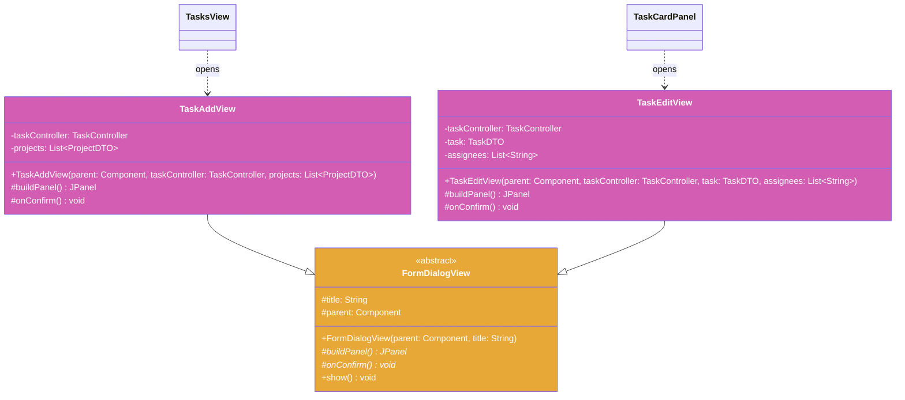

---

### UML 4.2: Project Form Views

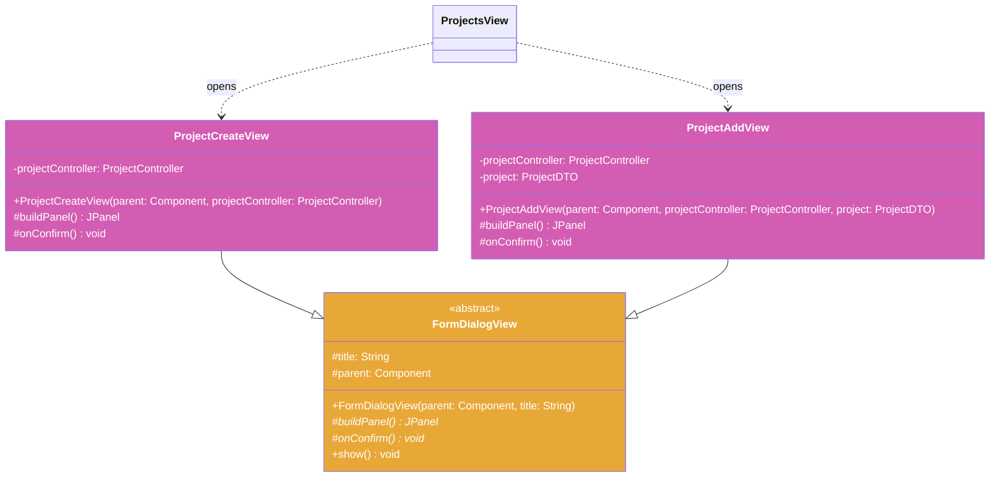

---

### UML 4.3: Sprint & Auth Form Views

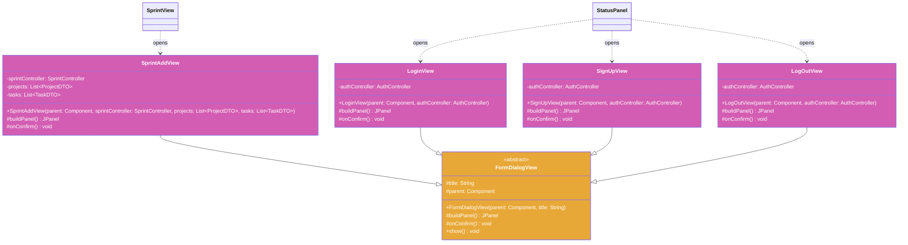

---

### UML 4.4: Error Views

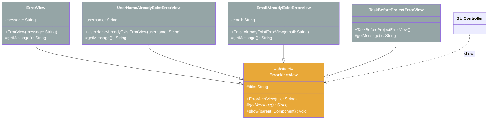

---

### UML 5: Service Layer (existing -- not changing)

Service interfaces define the business logic contract. Implementations (`TrakTaskService`, etc.) contain the actual
logic. `ServiceFactory` resolves the correct implementation (local or HTTP).

```mermaid
classDiagram
    direction TB

    class TaskService {
        <<interface>>
        +create(title: String, projectName: String, assignedTo: String, summary: String, deadline: Date, estimate: String) TaskDTO
        +getById(id: Long) TaskDTO
        +deleteById(id: Long) boolean
        +updateById(id: Long, newTitle: String, newStatus: String, newAssignedTo: String, newSummary: String) TaskDTO
        +listAll() List~TaskDTO~
        +listByAssignee(username: String) List~TaskDTO~
    }
    style TaskService fill: #16a085, color: #fff

    class ProjectService {
        <<interface>>
        +create(name: String) ProjectDTO
        +create(name: String, summary: String, owner: String, members: List~String~) ProjectDTO
        +getById(id: Long) ProjectDTO
        +getByName(name: String) ProjectDTO
        +deleteByName(name: String) boolean
        +updateByName(projectName: String, newName: String, newSummary: String, newMembers: List~String~) ProjectDTO
        +listAll() List~ProjectDTO~
        +listByUser(username: String) List~ProjectDTO~
        +addMember(projectName: String, username: String) ProjectDTO
    }
    style ProjectService fill: #16a085, color: #fff

    class SprintService {
        <<interface>>
        +create(name: String, projectName: String) SprintDTO
        +getById(id: Long) SprintDTO
        +getByName(name: String) SprintDTO
        +getByNameAndProject(name: String, projectName: String) SprintDTO
        +deleteByName(name: String) boolean
        +updateByName(name: String, startDate: String, endDate: String) SprintDTO
        +updateByNameAndProject(name: String, projectName: String, startDate: String, endDate: String) SprintDTO
        +updateTaskIds(name: String, taskIds: List~Long~) SprintDTO
        +listAll() List~SprintDTO~
    }
    style SprintService fill: #16a085, color: #fff

    class AuthService {
        <<interface>>
        +login(username: String, password: String) Session
        +signup(firstName: String, lastName: String, username: String, email: String, password: String) Session
        +logout() void
        +getCurrentSession() Session
        +isLoggedIn() boolean
    }
    style AuthService fill: #16a085, color: #fff

    class UserService {
        <<interface>>
        +create(username: String, firstName: String, lastName: String, email: String, password: String) UserDTO
        +getByUsername(username: String) UserDTO
        +getByEmail(email: String) UserDTO
        +deleteByUsername(username: String) boolean
        +updateByUsername(username: String, firstName: String, lastName: String, email: String, password: String) UserDTO
        +authenticate(username: String, password: String) boolean
    }
    style UserService fill: #16a085, color: #fff

    class BacklogService {
        <<interface>>
        +create(name: String, projectName: String) BacklogDTO
        +getByName(name: String) BacklogDTO
        +deleteByName(name: String) boolean
        +addTask(backlogName: String, taskId: Long) BacklogDTO
        +removeTask(backlogName: String, taskId: Long) BacklogDTO
    }
    style BacklogService fill: #16a085, color: #fff

    class ServiceFactory {
        -taskServiceSupplier: Supplier~TaskService~$
        -userServiceSupplier: Supplier~UserService~$
        -projectServiceSupplier: Supplier~ProjectService~$
        -sprintServiceSupplier: Supplier~SprintService~$
        -backlogServiceSupplier: Supplier~BacklogService~$
        -authServiceSupplier: Supplier~AuthService~$
        +register(task, user, project, sprint, backlog, auth)$ void
        +taskService()$ TaskService
        +userService()$ UserService
        +projectService()$ ProjectService
        +sprintService()$ SprintService
        +backlogService()$ BacklogService
        +authService()$ AuthService
        +registerHttpServices()$ void
        +registerLocalServices()$ void
    }

    ServiceFactory ..> TaskService: resolves
    ServiceFactory ..> ProjectService: resolves
    ServiceFactory ..> SprintService: resolves
    ServiceFactory ..> AuthService: resolves
    ServiceFactory ..> UserService: resolves
    ServiceFactory ..> BacklogService: resolves
```

---

### UML 6: Data Access Layer (existing -- not changing)

DAO interface and implementations abstract away storage. `DAOFactory` selects JSON, Parquet, or MongoDB.

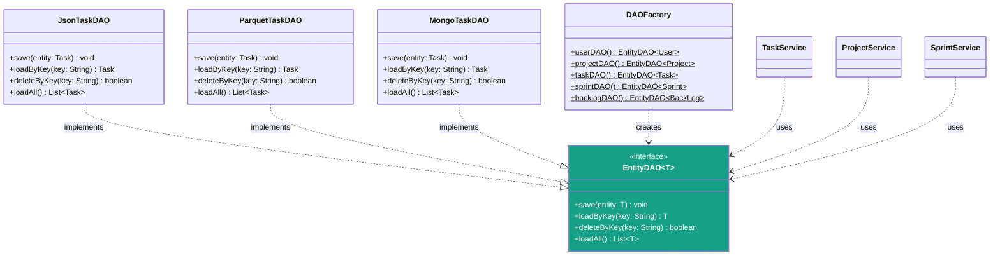

---

### Sequence: Add Task (full layer flow)

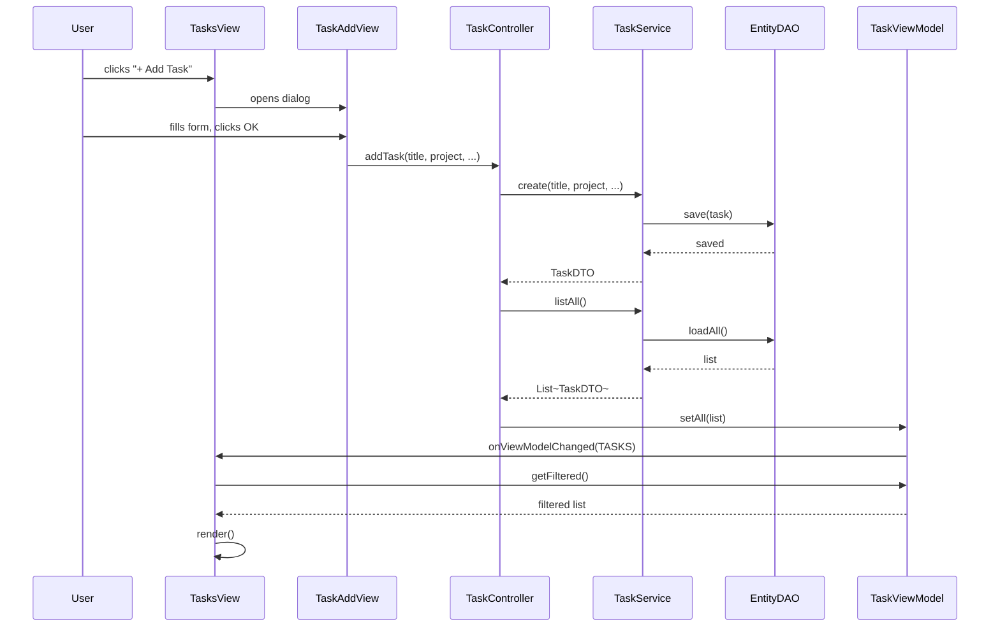

### Sequence: Observer Pattern -- Create Project, Then Add Task

Shows how the Observer pattern keeps cross-domain data fresh.

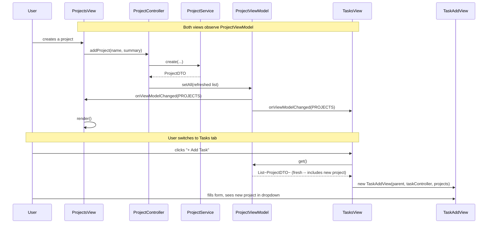

### Sequence: Sort Tasks (ViewModel stores state)

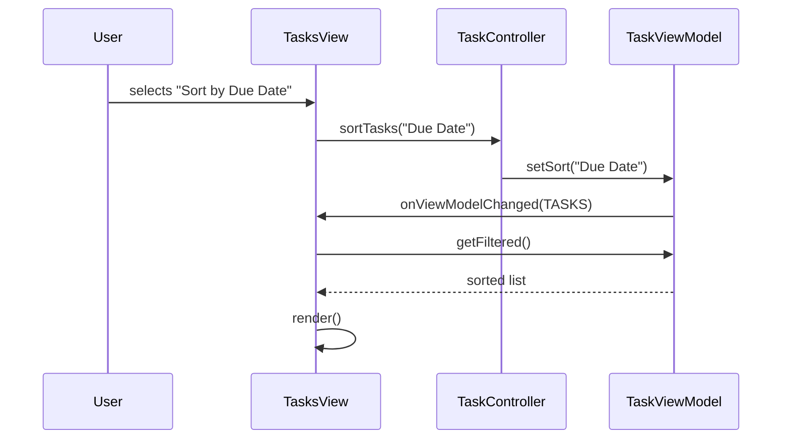

### Sequence: Signup Error (full layer flow)

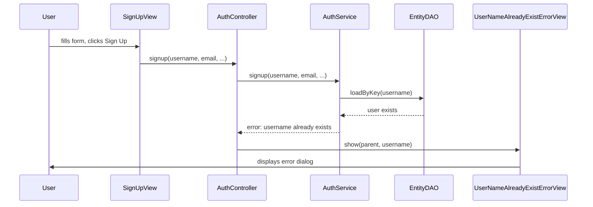

---

## HTTP Service Package Move

### Before

```
task.trak.app.client/
  ApiClient.java
  AuthHttpService.java
  UserHttpService.java
  ProjectHttpService.java
  TaskHttpService.java
  SprintHttpService.java
  BacklogHttpService.java
  cli/...
  gui/...
  config/...
```

### After

```
task.trak.app.client/
  cli/...
  gui/...
  config/...
  http/                          <-- NEW subpackage
    ApiClient.java
    AuthHttpService.java
    UserHttpService.java
    ProjectHttpService.java
    TaskHttpService.java
    SprintHttpService.java
    BacklogHttpService.java
```

### Import Updates Required

| File                    | Change                                                                                   |
|-------------------------|------------------------------------------------------------------------------------------|
| `ServiceFactory.java:3` | `import task.trak.app.client.*` --> `import task.trak.app.client.http.*`                 |
| `GUIMain.java:4`        | `import task.trak.app.client.ApiClient` --> `import task.trak.app.client.http.ApiClient` |
| `CLIMain.java`          | Same ApiClient import update                                                             |
| `Main.java`             | Same ApiClient import update (if referenced)                                             |

---

## Target Package Structure

```
gui/
  GUIMain.java                            (MODIFIED -- wires viewmodels --> controllers --> views)

  viewmodel/
    ViewModel.java                        (NEW -- interface: get/create/update/delete)
    ObservableViewModel.java              (NEW -- abstract, implements ViewModel + Serializable, save/load to .cache)
    ViewModelChangeListener.java          (NEW -- interface)
    ViewModelChangeType.java              (NEW -- enum)
    TaskViewModel.java                    (NEW -- presentation state for tasks)
    ProjectViewModel.java                 (NEW -- presentation state for projects)
    SprintViewModel.java                  (NEW -- presentation state for sprints)
    UserViewModel.java                    (NEW -- presentation state for session, errors)
    event/
      CommandEvent.java                   (MOVED from model/)
      CommandEventBus.java                (MOVED from model/)
      CommandEventType.java               (MOVED from model/)
      CommandListener.java                (MOVED from model/)

  controller/
    GUIController.java                    (NEW -- thin coordinator)
    AuthController.java                   (NEW -- calls AuthService, stores in UserViewModel)
    TaskController.java                   (NEW -- calls TaskService, stores in TaskViewModel)
    ProjectController.java                (NEW -- calls ProjectService, stores in ProjectViewModel)
    SprintController.java                 (NEW -- calls SprintService, stores in SprintViewModel)

  view/
    MainFrame.java                        (MODIFIED -- implements ViewModelChangeListener)
    DataView.java                         (NEW -- abstract JPanel with render())
    FormDialogView.java                   (NEW -- abstract: buildPanel()/onConfirm())
    ErrorAlertView.java                   (NEW -- abstract: getMessage())

    # Data views (extend DataView)
    TasksView.java                        (NEW)
    TaskCardPanel.java                    (MODIFIED -- no service call)
    ProjectsView.java                     (NEW)
    SprintView.java                       (NEW)
    OutputPanel.java                      (unchanged)
    StatusPanel.java                      (MODIFIED -- buttons only)
    CommandInputPanel.java                (unchanged)

    # Form views (extend FormDialogView)
    TaskAddView.java                      (NEW)
    TaskEditView.java                     (NEW)
    ProjectCreateView.java                (NEW)
    ProjectAddView.java                   (NEW)
    SprintAddView.java                    (NEW)
    SignUpView.java                       (NEW)
    LoginView.java                        (NEW)
    LogOutView.java                       (NEW)

    # Error views (extend ErrorAlertView)
    ErrorView.java                        (NEW)
    UserNameAlreadyExistErrorView.java    (NEW)
    EmailAlreadyExistErrorView.java       (NEW)
    TaskBeforeProjectErrorView.java       (NEW)

    # Deleted
    ContentPanel.java                     (DELETE)
    ErrorPanel.java                       (DELETE)
    AddPlaceholderPanel.java              (DELETE)

  model/                                  (DELETE -- replaced by viewmodel/)
```

Existing layers (not changing):

```
api/service/                              Service Layer (business logic)
  TaskService.java, ProjectService.java, SprintService.java,
  AuthService.java, UserService.java, BacklogService.java,
  ServiceFactory.java

app/server/dao/                           Data Access Layer
  EntityDAO.java, DAOFactory.java,
  json/*, parquet/*, mongo/*

api/dto/                                  Entities
  TaskDTO.java, ProjectDTO.java, SprintDTO.java,
  UserDTO.java, BacklogDTO.java
```

---

## Tradeoffs

| Decision                                                   | Alternative                         | Rationale                                                                                                                                                             |
|------------------------------------------------------------|-------------------------------------|-----------------------------------------------------------------------------------------------------------------------------------------------------------------------|
| MVC as presentation layer only                             | MVC encompassing service/DAO        | MVC is a presentation pattern (Views, ViewModels, Controllers). Service and DAO layers exist independently. Service layer is reusable across CLI, GUI, and remote API |
| ViewModels as pure data containers                         | ViewModels with business logic      | Business logic belongs in the Service layer. ViewModels just hold presentation state and notify Views. Controllers call Services, store results in ViewModels         |
| `ViewModel<T>` interface with get/create/update/delete     | No interface                        | Consistent contract. Controllers depend on the interface, not concrete ViewModels. Enables mocking                                                                    |
| Domain-specific ViewModels                                 | Single ViewModel                    | Each ViewModel owns one domain's presentation state. Easier to test in isolation                                                                                      |
| Filtering/sorting in ViewModel                             | Filter in Controller or Service     | ViewModels store presentation state including filter/sort settings. `TaskViewModel.getFiltered()` returns data ready for the View. Controller is a thin pass-through -- it tells ViewModel to change state, ViewModel notifies View |
| Observer pattern: views register on cross-domain ViewModels | Views only see their own controller | Views implement `ViewModelChangeListener` and register on all ViewModels they depend on. When `ProjectViewModel` updates, `TasksView` and `SprintView` are notified -- fresh data is available immediately when dialogs open. Inspired by Android LiveData's observe/setValue pattern. Solves the "add project then switch to tasks" stale data problem |
| `AuthController` extracted from `GUIController`            | Auth in `GUIController`             | GUIController becomes a thin coordinator. Auth is a distinct domain                                                                                                   |
| `FormDialogView` abstract with template pattern            | Each dialog has its own JOptionPane | Removes boilerplate. Subclasses only implement `buildPanel()` and `onConfirm()`                                                                                       |
| `ErrorAlertView` abstract with `getMessage()`              | Each error view independently       | All error views are alert dialogs. Abstract handles show, subclasses provide message                                                                                  |
| `DataView` abstract with `render()`                        | Each extends JPanel independently   | Consistent render contract across data views                                                                                                                          |
| Keep `CommandEventBus` alongside `ViewModelChangeListener` | Replace `CommandEventBus`           | Shared with CLI via `CMD_Factory`. Two systems, different roles                                                                                                       |

---

## Risk Assessment

| Risk                                                     | Impact | Mitigation                                                                             |
|----------------------------------------------------------|--------|----------------------------------------------------------------------------------------|
| Splitting `ContentPanel` (1272 lines) into 15+ files     | High   | Extract one view at a time. Test after each extraction                                 |
| Renaming model/ to viewmodel/                            | Medium | Package rename + import updates. Systematic with grep                                  |
| Five controllers instead of one                          | Medium | Each small and focused. GUIController is just a coordinator                            |
| Event class package move breaks imports                  | Medium | Update systematically with grep                                                        |
| `CMD_Factory` fires `CommandEventBus` -- must still work | High   | Bus stays functional, moves to `viewmodel/event/`. GUIController bridges to ViewModels |
| Dialog views need data from services                     | Medium | Controllers provide data as constructor params. Views never import ServiceFactory      |

---

## Files Changed Summary

| Action     | File                                                         | Notes                                            |
|------------|--------------------------------------------------------------|--------------------------------------------------|
| **NEW**    | `gui/viewmodel/ViewModel.java`                               | Interface -- get/create/update/delete            |
| **NEW**    | `gui/viewmodel/ObservableViewModel.java`                     | Abstract -- implements ViewModel + Serializable, save/load to .cache |
| **NEW**    | `gui/viewmodel/ViewModelChangeListener.java`                 | Interface                                        |
| **NEW**    | `gui/viewmodel/ViewModelChangeType.java`                     | Enum                                             |
| **NEW**    | `gui/viewmodel/TaskViewModel.java`                           | Presentation state for tasks                     |
| **NEW**    | `gui/viewmodel/ProjectViewModel.java`                        | Presentation state for projects                  |
| **NEW**    | `gui/viewmodel/SprintViewModel.java`                         | Presentation state for sprints                   |
| **NEW**    | `gui/viewmodel/UserViewModel.java`                           | Presentation state for session/errors            |
| **NEW**    | `gui/controller/GUIController.java`                          | Thin coordinator                                 |
| **NEW**    | `gui/controller/AuthController.java`                         | Calls AuthService, stores in UserViewModel       |
| **NEW**    | `gui/controller/TaskController.java`                         | Calls TaskService, stores in TaskViewModel       |
| **NEW**    | `gui/controller/ProjectController.java`                      | Calls ProjectService, stores in ProjectViewModel |
| **NEW**    | `gui/controller/SprintController.java`                       | Calls SprintService, stores in SprintViewModel   |
| **NEW**    | `gui/view/DataView.java`                                     | Abstract JPanel -- render()                      |
| **NEW**    | `gui/view/FormDialogView.java`                               | Abstract -- buildPanel()/onConfirm()             |
| **NEW**    | `gui/view/ErrorAlertView.java`                               | Abstract -- getMessage()                         |
| **MOVE**   | `gui/model/CommandEvent.java` --> `gui/viewmodel/event/`     | Package rename                                   |
| **MOVE**   | `gui/model/CommandEventBus.java` --> `gui/viewmodel/event/`  | Package rename                                   |
| **MOVE**   | `gui/model/CommandEventType.java` --> `gui/viewmodel/event/` | Package rename                                   |
| **MOVE**   | `gui/model/CommandListener.java` --> `gui/viewmodel/event/`  | Package rename                                   |
| **MOVE**   | `client/ApiClient.java` --> `client/http/`                   | Package move                                     |
| **MOVE**   | `client/*HttpService.java` (x6) --> `client/http/`           | Package move                                     |
| **NEW**    | `gui/view/TasksView.java`                                    | Extends DataView                                 |
| **NEW**    | `gui/view/TaskAddView.java`                                  | Extends FormDialogView                           |
| **NEW**    | `gui/view/TaskEditView.java`                                 | Extends FormDialogView                           |
| **NEW**    | `gui/view/ProjectsView.java`                                 | Extends DataView                                 |
| **NEW**    | `gui/view/ProjectCreateView.java`                            | Extends FormDialogView                           |
| **NEW**    | `gui/view/ProjectAddView.java`                               | Extends FormDialogView                           |
| **NEW**    | `gui/view/SprintView.java`                                   | Extends DataView                                 |
| **NEW**    | `gui/view/SprintAddView.java`                                | Extends FormDialogView                           |
| **NEW**    | `gui/view/SignUpView.java`                                   | Extends FormDialogView                           |
| **NEW**    | `gui/view/LoginView.java`                                    | Extends FormDialogView                           |
| **NEW**    | `gui/view/LogOutView.java`                                   | Extends FormDialogView                           |
| **NEW**    | `gui/view/ErrorView.java`                                    | Extends ErrorAlertView                           |
| **NEW**    | `gui/view/UserNameAlreadyExistErrorView.java`                | Extends ErrorAlertView                           |
| **NEW**    | `gui/view/EmailAlreadyExistErrorView.java`                   | Extends ErrorAlertView                           |
| **NEW**    | `gui/view/TaskBeforeProjectErrorView.java`                   | Extends ErrorAlertView                           |
| **MODIFY** | `gui/view/TaskCardPanel.java`                                | Remove ServiceFactory call                       |
| **MODIFY** | `gui/view/MainFrame.java`                                    | Implement ViewModelChangeListener                |
| **MODIFY** | `gui/view/StatusPanel.java`                                  | Extract dialogs                                  |
| **MODIFY** | `gui/GUIMain.java`                                           | Wire viewmodels --> controllers --> views        |
| **MODIFY** | `api/service/ServiceFactory.java`                            | Update HTTP import                               |
| **DELETE** | `gui/model/` (entire package)                                | Replaced by gui/viewmodel/                       |
| **DELETE** | `gui/view/ContentPanel.java`                                 | Split into views                                 |
| **DELETE** | `gui/view/ErrorPanel.java`                                   | Replaced by ErrorAlertView subclasses            |
| **DELETE** | `gui/view/AddPlaceholderPanel.java`                          | Absorbed into views                              |
| **DELETE** | `gui/controller/TTAppGUI.java`                               | Replaced by controllers                          |

---

## Test Coverage

All tests pass.

| Test File                      | Type     | Count | Status  |
|--------------------------------|----------|-------|---------|
| `AppModelTest.java`            | Unit     | 18    | Passing (tests TaskViewModel, ProjectViewModel, SprintViewModel, UserViewModel) |
| `ObserverPatternTest.java`     | Unit     | 11    | Passing (addObserver, removeObserver, notifyObservers, cross-domain, data freshness) |
| `HttpServicePackageTest.java`  | Unit     | 7     | Passing |
| `observer.feature` + `ObserverSteps.java` | Cucumber | 5 | Passing |
| `gui_mvc.feature` + `GUIMvcSteps.java` | Cucumber | 11 | Passing |
| `http_package.feature` + `HttpPackageSteps.java` | Cucumber | 8 | Passing |
| Existing tests                 | Mixed    | 138   | Passing |
