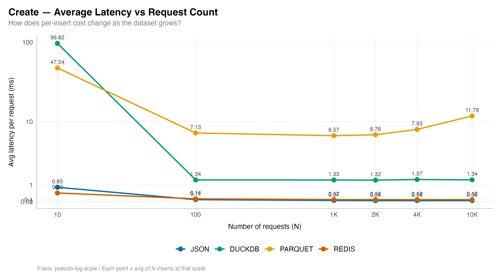
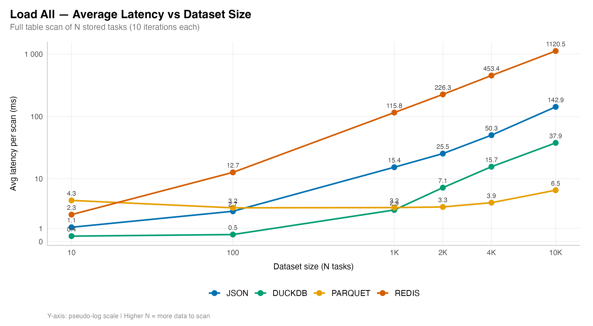
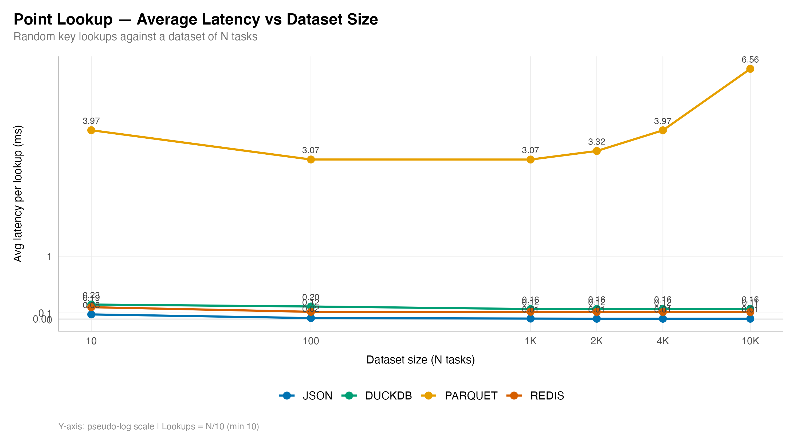
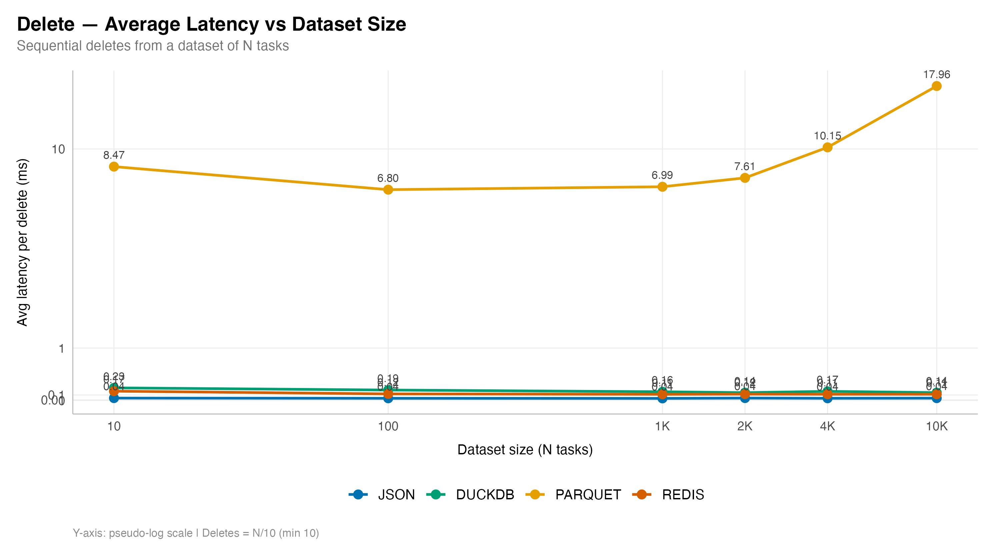
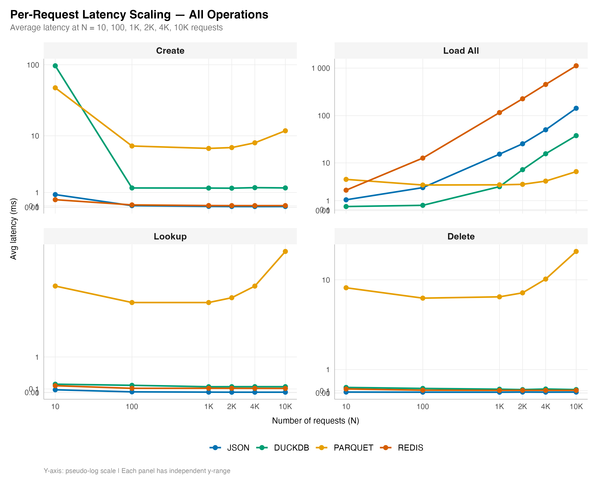
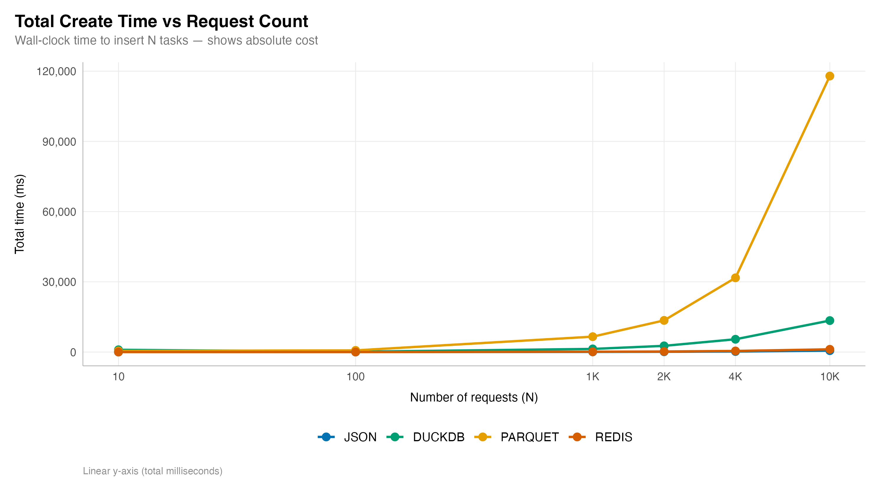

# Store Performance Analysis

Scaling benchmark of JSON, Parquet, DuckDB, and Redis storage backends for Trak's `EntityDAO<Task>` interface. Each store is tested at N = 10, 100, 1,000, 2,000, 4,000, and 10,000 requests.

## System Specifications

| Spec | Value |
|------|-------|
| OS | macOS 15.1 (Apple Silicon, aarch64) |
| CPU | 12 cores |
| Java | OpenJDK 23.0.1 (Oracle) |
| JVM | OpenJDK 64-Bit Server VM |
| Max Heap | 512 MB |
| Redis | 7.x (localhost:6379) |
| DuckDB | 1.5.2 (embedded JDBC) |

## Methodology

For each scale point N in {10, 100, 1000, 2000, 4000, 10000}:
- **Create**: N sequential `Task` inserts (clean store each run)
- **Load All**: 10 full-table scans of N tasks
- **Load by Key**: N/10 random point lookups (min 10)
- **Delete**: N/10 sequential deletes (min 10)

Timings captured via `System.nanoTime()` at microsecond precision.

### Reproducibility (Docker)

```bash
cd docs/store_analysis
./run.sh
```

---

## Results

### 1. Create Scaling



At small N (10), cold-start costs dominate — Parquet and DuckDB pay 47ms and 96ms respectively for initial file/table creation. As N grows, per-insert cost stabilizes: **JSON** and **Redis** remain sub-millisecond at all scales, **DuckDB** settles at ~1.3ms, and **Parquet** at ~12ms (full file rewrite each insert).

### 2. Load All Scaling



This is where scaling behavior diverges most dramatically. **Parquet** scales best — columnar format keeps scan cost low even at 10K (6.5ms). **DuckDB** grows moderately (38ms at 10K). **JSON** degrades to 143ms at 10K (must read N individual files). **Redis** is worst at 1,120ms (N individual GET round-trips).

### 3. Point Lookup Scaling



**JSON**, **DuckDB**, and **Redis** all remain flat and sub-millisecond regardless of dataset size — true O(1) lookup behavior. **Parquet** degrades from 3ms to 6.5ms at 10K because every lookup requires scanning the full columnar file (no index).

### 4. Delete Scaling



Similar pattern to lookups. **JSON**, **DuckDB**, and **Redis** are flat and sub-millisecond. **Parquet** degrades from 7ms to 18ms as the file being rewritten grows larger.

### 5. Combined View



### 6. Total Create Wall-Clock Time



The absolute cost chart makes Parquet's O(N^2) write behavior clear: 10K inserts take 120 seconds vs 0.9s for JSON and Redis.

---

## Key Findings

1. **JSON is the fastest all-rounder up to 10K.** Sub-millisecond creates, lookups, and deletes at every scale. Only weakness is `loadAll` at large N (143ms at 10K), which requires reading N individual files.

2. **Parquet has O(N) per-mutation cost.** Every create/delete rewrites the entire file, making total write time grow quadratically. Great for bulk reads (best `loadAll` at all scales) but unsuitable for write-heavy CRUD workloads.

3. **DuckDB scales well across all operations.** Moderate and stable per-insert cost (~1.3ms), fast lookups, and competitive bulk reads. The balanced choice for production.

4. **Redis is sub-millisecond for point operations but O(N) for scans.** `loadAll` reaches 1,120ms at 10K because it iterates all keys. Fine for lookup/write patterns; avoid full scans.

5. **Cold-start is real.** At N=10, DuckDB and Parquet pay steep initialization costs (table creation, file setup). At N>=100 these amortize away.

---

## Files

| File | Description |
|------|-------------|
| `trial_data.csv` | ~82K per-request data points (Store, Operation, N, Request#, Latency_us) |
| `results.csv` | Aggregate stats per (Store, Operation, N) |
| `system_specs.txt` | Machine specs at benchmark time |
| `analyze.R` | R script generating all scaling plots |
| `create_scaling.png` | Create avg latency vs N |
| `loadall_scaling.png` | Load All avg latency vs N |
| `lookup_scaling.png` | Point lookup avg latency vs N |
| `delete_scaling.png` | Delete avg latency vs N |
| `combined_scaling.png` | All 4 operations in faceted view |
| `total_scaling.png` | Total wall-clock time for creates |
| `Dockerfile` | Multi-stage build: Java benchmark + R analysis |
| `docker-compose.yml` | Redis + benchmark orchestration |
| `run.sh` | One-command pipeline runner |

*Generated by `StoreBenchmark.java` + `analyze.R`*
